This file is a merged representation of the entire codebase, combining all repository files into a single document.
Generated by Repopack on: 2024-12-01T16:49:30.235Z

================================================================
File Summary
================================================================

Purpose:
--------
This file contains a packed representation of the entire repository's contents.
It is designed to be easily consumable by AI systems for analysis, code review,
or other automated processes.

File Format:
------------
The content is organized as follows:
1. This summary section
2. Repository information
3. Repository structure
4. Multiple file entries, each consisting of:
  a. A separator line (================)
  b. The file path (File: path/to/file)
  c. Another separator line
  d. The full contents of the file
  e. A blank line

Usage Guidelines:
-----------------
- This file should be treated as read-only. Any changes should be made to the
  original repository files, not this packed version.
- When processing this file, use the file path to distinguish
  between different files in the repository.
- Be aware that this file may contain sensitive information. Handle it with
  the same level of security as you would the original repository.

Notes:
------
- Some files may have been excluded based on .gitignore rules and Repopack's
  configuration.
- Binary files are not included in this packed representation. Please refer to
  the Repository Structure section for a complete list of file paths, including
  binary files.

Additional Info:
----------------

For more information about Repopack, visit: https://github.com/yamadashy/repopack

================================================================
Repository Structure
================================================================
docs/
  mcp-specs/
    schema/
      schema.json
      schema.ts
    specification/
      architecture/
        index.md
      basic/
        utilities/
          _index.md
          cancellation.md
          ping.md
          progress.md
        index.md
        lifecycle.md
        messages.md
        transports.md
        versioning.md
      client/
        index.md
        roots.md
        sampling.md
      contributing/
        index.md
      revisions/
        2024-11-05.md
        index.md
      server/
        utilities/
          _index.md
          completion.md
          logging.md
          pagination.md
        _index.md
        prompts.md
        resources.md
        tools.md
      index.md
    about.md
    links.md
src/
  index.ts
_README.md
package.json
README.md
repomix.config.json
tsconfig.json

================================================================
Repository Files
================================================================

================
File: docs/mcp-specs/schema/schema.json
================
{
    "$schema": "http://json-schema.org/draft-07/schema#",
    "definitions": {
        "Annotated": {
            "description": "Base for objects that include optional annotations for the client. The client can use annotations to inform how objects are used or displayed",
            "properties": {
                "annotations": {
                    "properties": {
                        "audience": {
                            "description": "Describes who the intended customer of this object or data is.\n\nIt can include multiple entries to indicate content useful for multiple audiences (e.g., `[\"user\", \"assistant\"]`).",
                            "items": {
                                "$ref": "#/definitions/Role"
                            },
                            "type": "array"
                        },
                        "priority": {
                            "description": "Describes how important this data is for operating the server.\n\nA value of 1 means \"most important,\" and indicates that the data is\neffectively required, while 0 means \"least important,\" and indicates that\nthe data is entirely optional.",
                            "maximum": 1,
                            "minimum": 0,
                            "type": "number"
                        }
                    },
                    "type": "object"
                }
            },
            "type": "object"
        },
        "BlobResourceContents": {
            "properties": {
                "blob": {
                    "description": "A base64-encoded string representing the binary data of the item.",
                    "format": "byte",
                    "type": "string"
                },
                "mimeType": {
                    "description": "The MIME type of this resource, if known.",
                    "type": "string"
                },
                "uri": {
                    "description": "The URI of this resource.",
                    "format": "uri",
                    "type": "string"
                }
            },
            "required": [
                "blob",
                "uri"
            ],
            "type": "object"
        },
        "CallToolRequest": {
            "description": "Used by the client to invoke a tool provided by the server.",
            "properties": {
                "method": {
                    "const": "tools/call",
                    "type": "string"
                },
                "params": {
                    "properties": {
                        "arguments": {
                            "additionalProperties": {},
                            "type": "object"
                        },
                        "name": {
                            "type": "string"
                        }
                    },
                    "required": [
                        "name"
                    ],
                    "type": "object"
                }
            },
            "required": [
                "method",
                "params"
            ],
            "type": "object"
        },
        "CallToolResult": {
            "description": "The server's response to a tool call.\n\nAny errors that originate from the tool SHOULD be reported inside the result\nobject, with `isError` set to true, _not_ as an MCP protocol-level error\nresponse. Otherwise, the LLM would not be able to see that an error occurred\nand self-correct.\n\nHowever, any errors in _finding_ the tool, an error indicating that the\nserver does not support tool calls, or any other exceptional conditions,\nshould be reported as an MCP error response.",
            "properties": {
                "_meta": {
                    "additionalProperties": {},
                    "description": "This result property is reserved by the protocol to allow clients and servers to attach additional metadata to their responses.",
                    "type": "object"
                },
                "content": {
                    "items": {
                        "anyOf": [
                            {
                                "$ref": "#/definitions/TextContent"
                            },
                            {
                                "$ref": "#/definitions/ImageContent"
                            },
                            {
                                "$ref": "#/definitions/EmbeddedResource"
                            }
                        ]
                    },
                    "type": "array"
                },
                "isError": {
                    "description": "Whether the tool call ended in an error.\n\nIf not set, this is assumed to be false (the call was successful).",
                    "type": "boolean"
                }
            },
            "required": [
                "content"
            ],
            "type": "object"
        },
        "CancelledNotification": {
            "description": "This notification can be sent by either side to indicate that it is cancelling a previously-issued request.\n\nThe request SHOULD still be in-flight, but due to communication latency, it is always possible that this notification MAY arrive after the request has already finished.\n\nThis notification indicates that the result will be unused, so any associated processing SHOULD cease.\n\nA client MUST NOT attempt to cancel its `initialize` request.",
            "properties": {
                "method": {
                    "const": "notifications/cancelled",
                    "type": "string"
                },
                "params": {
                    "properties": {
                        "reason": {
                            "description": "An optional string describing the reason for the cancellation. This MAY be logged or presented to the user.",
                            "type": "string"
                        },
                        "requestId": {
                            "$ref": "#/definitions/RequestId",
                            "description": "The ID of the request to cancel.\n\nThis MUST correspond to the ID of a request previously issued in the same direction."
                        }
                    },
                    "required": [
                        "requestId"
                    ],
                    "type": "object"
                }
            },
            "required": [
                "method",
                "params"
            ],
            "type": "object"
        },
        "ClientCapabilities": {
            "description": "Capabilities a client may support. Known capabilities are defined here, in this schema, but this is not a closed set: any client can define its own, additional capabilities.",
            "properties": {
                "experimental": {
                    "additionalProperties": {
                        "additionalProperties": true,
                        "properties": {},
                        "type": "object"
                    },
                    "description": "Experimental, non-standard capabilities that the client supports.",
                    "type": "object"
                },
                "roots": {
                    "description": "Present if the client supports listing roots.",
                    "properties": {
                        "listChanged": {
                            "description": "Whether the client supports notifications for changes to the roots list.",
                            "type": "boolean"
                        }
                    },
                    "type": "object"
                },
                "sampling": {
                    "additionalProperties": true,
                    "description": "Present if the client supports sampling from an LLM.",
                    "properties": {},
                    "type": "object"
                }
            },
            "type": "object"
        },
        "ClientNotification": {
            "anyOf": [
                {
                    "$ref": "#/definitions/CancelledNotification"
                },
                {
                    "$ref": "#/definitions/InitializedNotification"
                },
                {
                    "$ref": "#/definitions/ProgressNotification"
                },
                {
                    "$ref": "#/definitions/RootsListChangedNotification"
                }
            ]
        },
        "ClientRequest": {
            "anyOf": [
                {
                    "$ref": "#/definitions/InitializeRequest"
                },
                {
                    "$ref": "#/definitions/PingRequest"
                },
                {
                    "$ref": "#/definitions/ListResourcesRequest"
                },
                {
                    "$ref": "#/definitions/ReadResourceRequest"
                },
                {
                    "$ref": "#/definitions/SubscribeRequest"
                },
                {
                    "$ref": "#/definitions/UnsubscribeRequest"
                },
                {
                    "$ref": "#/definitions/ListPromptsRequest"
                },
                {
                    "$ref": "#/definitions/GetPromptRequest"
                },
                {
                    "$ref": "#/definitions/ListToolsRequest"
                },
                {
                    "$ref": "#/definitions/CallToolRequest"
                },
                {
                    "$ref": "#/definitions/SetLevelRequest"
                },
                {
                    "$ref": "#/definitions/CompleteRequest"
                }
            ]
        },
        "ClientResult": {
            "anyOf": [
                {
                    "$ref": "#/definitions/Result"
                },
                {
                    "$ref": "#/definitions/CreateMessageResult"
                },
                {
                    "$ref": "#/definitions/ListRootsResult"
                }
            ]
        },
        "CompleteRequest": {
            "description": "A request from the client to the server, to ask for completion options.",
            "properties": {
                "method": {
                    "const": "completion/complete",
                    "type": "string"
                },
                "params": {
                    "properties": {
                        "argument": {
                            "description": "The argument's information",
                            "properties": {
                                "name": {
                                    "description": "The name of the argument",
                                    "type": "string"
                                },
                                "value": {
                                    "description": "The value of the argument to use for completion matching.",
                                    "type": "string"
                                }
                            },
                            "required": [
                                "name",
                                "value"
                            ],
                            "type": "object"
                        },
                        "ref": {
                            "anyOf": [
                                {
                                    "$ref": "#/definitions/PromptReference"
                                },
                                {
                                    "$ref": "#/definitions/ResourceReference"
                                }
                            ]
                        }
                    },
                    "required": [
                        "argument",
                        "ref"
                    ],
                    "type": "object"
                }
            },
            "required": [
                "method",
                "params"
            ],
            "type": "object"
        },
        "CompleteResult": {
            "description": "The server's response to a completion/complete request",
            "properties": {
                "_meta": {
                    "additionalProperties": {},
                    "description": "This result property is reserved by the protocol to allow clients and servers to attach additional metadata to their responses.",
                    "type": "object"
                },
                "completion": {
                    "properties": {
                        "hasMore": {
                            "description": "Indicates whether there are additional completion options beyond those provided in the current response, even if the exact total is unknown.",
                            "type": "boolean"
                        },
                        "total": {
                            "description": "The total number of completion options available. This can exceed the number of values actually sent in the response.",
                            "type": "integer"
                        },
                        "values": {
                            "description": "An array of completion values. Must not exceed 100 items.",
                            "items": {
                                "type": "string"
                            },
                            "type": "array"
                        }
                    },
                    "required": [
                        "values"
                    ],
                    "type": "object"
                }
            },
            "required": [
                "completion"
            ],
            "type": "object"
        },
        "CreateMessageRequest": {
            "description": "A request from the server to sample an LLM via the client. The client has full discretion over which model to select. The client should also inform the user before beginning sampling, to allow them to inspect the request (human in the loop) and decide whether to approve it.",
            "properties": {
                "method": {
                    "const": "sampling/createMessage",
                    "type": "string"
                },
                "params": {
                    "properties": {
                        "includeContext": {
                            "description": "A request to include context from one or more MCP servers (including the caller), to be attached to the prompt. The client MAY ignore this request.",
                            "enum": [
                                "allServers",
                                "none",
                                "thisServer"
                            ],
                            "type": "string"
                        },
                        "maxTokens": {
                            "description": "The maximum number of tokens to sample, as requested by the server. The client MAY choose to sample fewer tokens than requested.",
                            "type": "integer"
                        },
                        "messages": {
                            "items": {
                                "$ref": "#/definitions/SamplingMessage"
                            },
                            "type": "array"
                        },
                        "metadata": {
                            "additionalProperties": true,
                            "description": "Optional metadata to pass through to the LLM provider. The format of this metadata is provider-specific.",
                            "properties": {},
                            "type": "object"
                        },
                        "modelPreferences": {
                            "$ref": "#/definitions/ModelPreferences",
                            "description": "The server's preferences for which model to select. The client MAY ignore these preferences."
                        },
                        "stopSequences": {
                            "items": {
                                "type": "string"
                            },
                            "type": "array"
                        },
                        "systemPrompt": {
                            "description": "An optional system prompt the server wants to use for sampling. The client MAY modify or omit this prompt.",
                            "type": "string"
                        },
                        "temperature": {
                            "type": "number"
                        }
                    },
                    "required": [
                        "maxTokens",
                        "messages"
                    ],
                    "type": "object"
                }
            },
            "required": [
                "method",
                "params"
            ],
            "type": "object"
        },
        "CreateMessageResult": {
            "description": "The client's response to a sampling/create_message request from the server. The client should inform the user before returning the sampled message, to allow them to inspect the response (human in the loop) and decide whether to allow the server to see it.",
            "properties": {
                "_meta": {
                    "additionalProperties": {},
                    "description": "This result property is reserved by the protocol to allow clients and servers to attach additional metadata to their responses.",
                    "type": "object"
                },
                "content": {
                    "anyOf": [
                        {
                            "$ref": "#/definitions/TextContent"
                        },
                        {
                            "$ref": "#/definitions/ImageContent"
                        }
                    ]
                },
                "model": {
                    "description": "The name of the model that generated the message.",
                    "type": "string"
                },
                "role": {
                    "$ref": "#/definitions/Role"
                },
                "stopReason": {
                    "description": "The reason why sampling stopped, if known.",
                    "type": "string"
                }
            },
            "required": [
                "content",
                "model",
                "role"
            ],
            "type": "object"
        },
        "Cursor": {
            "description": "An opaque token used to represent a cursor for pagination.",
            "type": "string"
        },
        "EmbeddedResource": {
            "description": "The contents of a resource, embedded into a prompt or tool call result.\n\nIt is up to the client how best to render embedded resources for the benefit\nof the LLM and/or the user.",
            "properties": {
                "annotations": {
                    "properties": {
                        "audience": {
                            "description": "Describes who the intended customer of this object or data is.\n\nIt can include multiple entries to indicate content useful for multiple audiences (e.g., `[\"user\", \"assistant\"]`).",
                            "items": {
                                "$ref": "#/definitions/Role"
                            },
                            "type": "array"
                        },
                        "priority": {
                            "description": "Describes how important this data is for operating the server.\n\nA value of 1 means \"most important,\" and indicates that the data is\neffectively required, while 0 means \"least important,\" and indicates that\nthe data is entirely optional.",
                            "maximum": 1,
                            "minimum": 0,
                            "type": "number"
                        }
                    },
                    "type": "object"
                },
                "resource": {
                    "anyOf": [
                        {
                            "$ref": "#/definitions/TextResourceContents"
                        },
                        {
                            "$ref": "#/definitions/BlobResourceContents"
                        }
                    ]
                },
                "type": {
                    "const": "resource",
                    "type": "string"
                }
            },
            "required": [
                "resource",
                "type"
            ],
            "type": "object"
        },
        "EmptyResult": {
            "$ref": "#/definitions/Result"
        },
        "GetPromptRequest": {
            "description": "Used by the client to get a prompt provided by the server.",
            "properties": {
                "method": {
                    "const": "prompts/get",
                    "type": "string"
                },
                "params": {
                    "properties": {
                        "arguments": {
                            "additionalProperties": {
                                "type": "string"
                            },
                            "description": "Arguments to use for templating the prompt.",
                            "type": "object"
                        },
                        "name": {
                            "description": "The name of the prompt or prompt template.",
                            "type": "string"
                        }
                    },
                    "required": [
                        "name"
                    ],
                    "type": "object"
                }
            },
            "required": [
                "method",
                "params"
            ],
            "type": "object"
        },
        "GetPromptResult": {
            "description": "The server's response to a prompts/get request from the client.",
            "properties": {
                "_meta": {
                    "additionalProperties": {},
                    "description": "This result property is reserved by the protocol to allow clients and servers to attach additional metadata to their responses.",
                    "type": "object"
                },
                "description": {
                    "description": "An optional description for the prompt.",
                    "type": "string"
                },
                "messages": {
                    "items": {
                        "$ref": "#/definitions/PromptMessage"
                    },
                    "type": "array"
                }
            },
            "required": [
                "messages"
            ],
            "type": "object"
        },
        "ImageContent": {
            "description": "An image provided to or from an LLM.",
            "properties": {
                "annotations": {
                    "properties": {
                        "audience": {
                            "description": "Describes who the intended customer of this object or data is.\n\nIt can include multiple entries to indicate content useful for multiple audiences (e.g., `[\"user\", \"assistant\"]`).",
                            "items": {
                                "$ref": "#/definitions/Role"
                            },
                            "type": "array"
                        },
                        "priority": {
                            "description": "Describes how important this data is for operating the server.\n\nA value of 1 means \"most important,\" and indicates that the data is\neffectively required, while 0 means \"least important,\" and indicates that\nthe data is entirely optional.",
                            "maximum": 1,
                            "minimum": 0,
                            "type": "number"
                        }
                    },
                    "type": "object"
                },
                "data": {
                    "description": "The base64-encoded image data.",
                    "format": "byte",
                    "type": "string"
                },
                "mimeType": {
                    "description": "The MIME type of the image. Different providers may support different image types.",
                    "type": "string"
                },
                "type": {
                    "const": "image",
                    "type": "string"
                }
            },
            "required": [
                "data",
                "mimeType",
                "type"
            ],
            "type": "object"
        },
        "Implementation": {
            "description": "Describes the name and version of an MCP implementation.",
            "properties": {
                "name": {
                    "type": "string"
                },
                "version": {
                    "type": "string"
                }
            },
            "required": [
                "name",
                "version"
            ],
            "type": "object"
        },
        "InitializeRequest": {
            "description": "This request is sent from the client to the server when it first connects, asking it to begin initialization.",
            "properties": {
                "method": {
                    "const": "initialize",
                    "type": "string"
                },
                "params": {
                    "properties": {
                        "capabilities": {
                            "$ref": "#/definitions/ClientCapabilities"
                        },
                        "clientInfo": {
                            "$ref": "#/definitions/Implementation"
                        },
                        "protocolVersion": {
                            "description": "The latest version of the Model Context Protocol that the client supports. The client MAY decide to support older versions as well.",
                            "type": "string"
                        }
                    },
                    "required": [
                        "capabilities",
                        "clientInfo",
                        "protocolVersion"
                    ],
                    "type": "object"
                }
            },
            "required": [
                "method",
                "params"
            ],
            "type": "object"
        },
        "InitializeResult": {
            "description": "After receiving an initialize request from the client, the server sends this response.",
            "properties": {
                "_meta": {
                    "additionalProperties": {},
                    "description": "This result property is reserved by the protocol to allow clients and servers to attach additional metadata to their responses.",
                    "type": "object"
                },
                "capabilities": {
                    "$ref": "#/definitions/ServerCapabilities"
                },
                "instructions": {
                    "description": "Instructions describing how to use the server and its features.\n\nThis can be used by clients to improve the LLM's understanding of available tools, resources, etc. It can be thought of like a \"hint\" to the model. For example, this information MAY be added to the system prompt.",
                    "type": "string"
                },
                "protocolVersion": {
                    "description": "The version of the Model Context Protocol that the server wants to use. This may not match the version that the client requested. If the client cannot support this version, it MUST disconnect.",
                    "type": "string"
                },
                "serverInfo": {
                    "$ref": "#/definitions/Implementation"
                }
            },
            "required": [
                "capabilities",
                "protocolVersion",
                "serverInfo"
            ],
            "type": "object"
        },
        "InitializedNotification": {
            "description": "This notification is sent from the client to the server after initialization has finished.",
            "properties": {
                "method": {
                    "const": "notifications/initialized",
                    "type": "string"
                },
                "params": {
                    "additionalProperties": {},
                    "properties": {
                        "_meta": {
                            "additionalProperties": {},
                            "description": "This parameter name is reserved by MCP to allow clients and servers to attach additional metadata to their notifications.",
                            "type": "object"
                        }
                    },
                    "type": "object"
                }
            },
            "required": [
                "method"
            ],
            "type": "object"
        },
        "JSONRPCError": {
            "description": "A response to a request that indicates an error occurred.",
            "properties": {
                "error": {
                    "properties": {
                        "code": {
                            "description": "The error type that occurred.",
                            "type": "integer"
                        },
                        "data": {
                            "description": "Additional information about the error. The value of this member is defined by the sender (e.g. detailed error information, nested errors etc.)."
                        },
                        "message": {
                            "description": "A short description of the error. The message SHOULD be limited to a concise single sentence.",
                            "type": "string"
                        }
                    },
                    "required": [
                        "code",
                        "message"
                    ],
                    "type": "object"
                },
                "id": {
                    "$ref": "#/definitions/RequestId"
                },
                "jsonrpc": {
                    "const": "2.0",
                    "type": "string"
                }
            },
            "required": [
                "error",
                "id",
                "jsonrpc"
            ],
            "type": "object"
        },
        "JSONRPCMessage": {
            "anyOf": [
                {
                    "$ref": "#/definitions/JSONRPCRequest"
                },
                {
                    "$ref": "#/definitions/JSONRPCNotification"
                },
                {
                    "$ref": "#/definitions/JSONRPCResponse"
                },
                {
                    "$ref": "#/definitions/JSONRPCError"
                }
            ]
        },
        "JSONRPCNotification": {
            "description": "A notification which does not expect a response.",
            "properties": {
                "jsonrpc": {
                    "const": "2.0",
                    "type": "string"
                },
                "method": {
                    "type": "string"
                },
                "params": {
                    "additionalProperties": {},
                    "properties": {
                        "_meta": {
                            "additionalProperties": {},
                            "description": "This parameter name is reserved by MCP to allow clients and servers to attach additional metadata to their notifications.",
                            "type": "object"
                        }
                    },
                    "type": "object"
                }
            },
            "required": [
                "jsonrpc",
                "method"
            ],
            "type": "object"
        },
        "JSONRPCRequest": {
            "description": "A request that expects a response.",
            "properties": {
                "id": {
                    "$ref": "#/definitions/RequestId"
                },
                "jsonrpc": {
                    "const": "2.0",
                    "type": "string"
                },
                "method": {
                    "type": "string"
                },
                "params": {
                    "additionalProperties": {},
                    "properties": {
                        "_meta": {
                            "properties": {
                                "progressToken": {
                                    "$ref": "#/definitions/ProgressToken",
                                    "description": "If specified, the caller is requesting out-of-band progress notifications for this request (as represented by notifications/progress). The value of this parameter is an opaque token that will be attached to any subsequent notifications. The receiver is not obligated to provide these notifications."
                                }
                            },
                            "type": "object"
                        }
                    },
                    "type": "object"
                }
            },
            "required": [
                "id",
                "jsonrpc",
                "method"
            ],
            "type": "object"
        },
        "JSONRPCResponse": {
            "description": "A successful (non-error) response to a request.",
            "properties": {
                "id": {
                    "$ref": "#/definitions/RequestId"
                },
                "jsonrpc": {
                    "const": "2.0",
                    "type": "string"
                },
                "result": {
                    "$ref": "#/definitions/Result"
                }
            },
            "required": [
                "id",
                "jsonrpc",
                "result"
            ],
            "type": "object"
        },
        "ListPromptsRequest": {
            "description": "Sent from the client to request a list of prompts and prompt templates the server has.",
            "properties": {
                "method": {
                    "const": "prompts/list",
                    "type": "string"
                },
                "params": {
                    "properties": {
                        "cursor": {
                            "description": "An opaque token representing the current pagination position.\nIf provided, the server should return results starting after this cursor.",
                            "type": "string"
                        }
                    },
                    "type": "object"
                }
            },
            "required": [
                "method"
            ],
            "type": "object"
        },
        "ListPromptsResult": {
            "description": "The server's response to a prompts/list request from the client.",
            "properties": {
                "_meta": {
                    "additionalProperties": {},
                    "description": "This result property is reserved by the protocol to allow clients and servers to attach additional metadata to their responses.",
                    "type": "object"
                },
                "nextCursor": {
                    "description": "An opaque token representing the pagination position after the last returned result.\nIf present, there may be more results available.",
                    "type": "string"
                },
                "prompts": {
                    "items": {
                        "$ref": "#/definitions/Prompt"
                    },
                    "type": "array"
                }
            },
            "required": [
                "prompts"
            ],
            "type": "object"
        },
        "ListResourceTemplatesRequest": {
            "description": "Sent from the client to request a list of resource templates the server has.",
            "properties": {
                "method": {
                    "const": "resources/templates/list",
                    "type": "string"
                },
                "params": {
                    "properties": {
                        "cursor": {
                            "description": "An opaque token representing the current pagination position.\nIf provided, the server should return results starting after this cursor.",
                            "type": "string"
                        }
                    },
                    "type": "object"
                }
            },
            "required": [
                "method"
            ],
            "type": "object"
        },
        "ListResourceTemplatesResult": {
            "description": "The server's response to a resources/templates/list request from the client.",
            "properties": {
                "_meta": {
                    "additionalProperties": {},
                    "description": "This result property is reserved by the protocol to allow clients and servers to attach additional metadata to their responses.",
                    "type": "object"
                },
                "nextCursor": {
                    "description": "An opaque token representing the pagination position after the last returned result.\nIf present, there may be more results available.",
                    "type": "string"
                },
                "resourceTemplates": {
                    "items": {
                        "$ref": "#/definitions/ResourceTemplate"
                    },
                    "type": "array"
                }
            },
            "required": [
                "resourceTemplates"
            ],
            "type": "object"
        },
        "ListResourcesRequest": {
            "description": "Sent from the client to request a list of resources the server has.",
            "properties": {
                "method": {
                    "const": "resources/list",
                    "type": "string"
                },
                "params": {
                    "properties": {
                        "cursor": {
                            "description": "An opaque token representing the current pagination position.\nIf provided, the server should return results starting after this cursor.",
                            "type": "string"
                        }
                    },
                    "type": "object"
                }
            },
            "required": [
                "method"
            ],
            "type": "object"
        },
        "ListResourcesResult": {
            "description": "The server's response to a resources/list request from the client.",
            "properties": {
                "_meta": {
                    "additionalProperties": {},
                    "description": "This result property is reserved by the protocol to allow clients and servers to attach additional metadata to their responses.",
                    "type": "object"
                },
                "nextCursor": {
                    "description": "An opaque token representing the pagination position after the last returned result.\nIf present, there may be more results available.",
                    "type": "string"
                },
                "resources": {
                    "items": {
                        "$ref": "#/definitions/Resource"
                    },
                    "type": "array"
                }
            },
            "required": [
                "resources"
            ],
            "type": "object"
        },
        "ListRootsRequest": {
            "description": "Sent from the server to request a list of root URIs from the client. Roots allow\nservers to ask for specific directories or files to operate on. A common example\nfor roots is providing a set of repositories or directories a server should operate\non.\n\nThis request is typically used when the server needs to understand the file system\nstructure or access specific locations that the client has permission to read from.",
            "properties": {
                "method": {
                    "const": "roots/list",
                    "type": "string"
                },
                "params": {
                    "additionalProperties": {},
                    "properties": {
                        "_meta": {
                            "properties": {
                                "progressToken": {
                                    "$ref": "#/definitions/ProgressToken",
                                    "description": "If specified, the caller is requesting out-of-band progress notifications for this request (as represented by notifications/progress). The value of this parameter is an opaque token that will be attached to any subsequent notifications. The receiver is not obligated to provide these notifications."
                                }
                            },
                            "type": "object"
                        }
                    },
                    "type": "object"
                }
            },
            "required": [
                "method"
            ],
            "type": "object"
        },
        "ListRootsResult": {
            "description": "The client's response to a roots/list request from the server.\nThis result contains an array of Root objects, each representing a root directory\nor file that the server can operate on.",
            "properties": {
                "_meta": {
                    "additionalProperties": {},
                    "description": "This result property is reserved by the protocol to allow clients and servers to attach additional metadata to their responses.",
                    "type": "object"
                },
                "roots": {
                    "items": {
                        "$ref": "#/definitions/Root"
                    },
                    "type": "array"
                }
            },
            "required": [
                "roots"
            ],
            "type": "object"
        },
        "ListToolsRequest": {
            "description": "Sent from the client to request a list of tools the server has.",
            "properties": {
                "method": {
                    "const": "tools/list",
                    "type": "string"
                },
                "params": {
                    "properties": {
                        "cursor": {
                            "description": "An opaque token representing the current pagination position.\nIf provided, the server should return results starting after this cursor.",
                            "type": "string"
                        }
                    },
                    "type": "object"
                }
            },
            "required": [
                "method"
            ],
            "type": "object"
        },
        "ListToolsResult": {
            "description": "The server's response to a tools/list request from the client.",
            "properties": {
                "_meta": {
                    "additionalProperties": {},
                    "description": "This result property is reserved by the protocol to allow clients and servers to attach additional metadata to their responses.",
                    "type": "object"
                },
                "nextCursor": {
                    "description": "An opaque token representing the pagination position after the last returned result.\nIf present, there may be more results available.",
                    "type": "string"
                },
                "tools": {
                    "items": {
                        "$ref": "#/definitions/Tool"
                    },
                    "type": "array"
                }
            },
            "required": [
                "tools"
            ],
            "type": "object"
        },
        "LoggingLevel": {
            "description": "The severity of a log message.\n\nThese map to syslog message severities, as specified in RFC-5424:\nhttps://datatracker.ietf.org/doc/html/rfc5424#section-6.2.1",
            "enum": [
                "alert",
                "critical",
                "debug",
                "emergency",
                "error",
                "info",
                "notice",
                "warning"
            ],
            "type": "string"
        },
        "LoggingMessageNotification": {
            "description": "Notification of a log message passed from server to client. If no logging/setLevel request has been sent from the client, the server MAY decide which messages to send automatically.",
            "properties": {
                "method": {
                    "const": "notifications/message",
                    "type": "string"
                },
                "params": {
                    "properties": {
                        "data": {
                            "description": "The data to be logged, such as a string message or an object. Any JSON serializable type is allowed here."
                        },
                        "level": {
                            "$ref": "#/definitions/LoggingLevel",
                            "description": "The severity of this log message."
                        },
                        "logger": {
                            "description": "An optional name of the logger issuing this message.",
                            "type": "string"
                        }
                    },
                    "required": [
                        "data",
                        "level"
                    ],
                    "type": "object"
                }
            },
            "required": [
                "method",
                "params"
            ],
            "type": "object"
        },
        "ModelHint": {
            "description": "Hints to use for model selection.\n\nKeys not declared here are currently left unspecified by the spec and are up\nto the client to interpret.",
            "properties": {
                "name": {
                    "description": "A hint for a model name.\n\nThe client SHOULD treat this as a substring of a model name; for example:\n - `claude-3-5-sonnet` should match `claude-3-5-sonnet-20241022`\n - `sonnet` should match `claude-3-5-sonnet-20241022`, `claude-3-sonnet-20240229`, etc.\n - `claude` should match any Claude model\n\nThe client MAY also map the string to a different provider's model name or a different model family, as long as it fills a similar niche; for example:\n - `gemini-1.5-flash` could match `claude-3-haiku-20240307`",
                    "type": "string"
                }
            },
            "type": "object"
        },
        "ModelPreferences": {
            "description": "The server's preferences for model selection, requested of the client during sampling.\n\nBecause LLMs can vary along multiple dimensions, choosing the \"best\" model is\nrarely straightforward.  Different models excel in different areas—some are\nfaster but less capable, others are more capable but more expensive, and so\non. This interface allows servers to express their priorities across multiple\ndimensions to help clients make an appropriate selection for their use case.\n\nThese preferences are always advisory. The client MAY ignore them. It is also\nup to the client to decide how to interpret these preferences and how to\nbalance them against other considerations.",
            "properties": {
                "costPriority": {
                    "description": "How much to prioritize cost when selecting a model. A value of 0 means cost\nis not important, while a value of 1 means cost is the most important\nfactor.",
                    "maximum": 1,
                    "minimum": 0,
                    "type": "number"
                },
                "hints": {
                    "description": "Optional hints to use for model selection.\n\nIf multiple hints are specified, the client MUST evaluate them in order\n(such that the first match is taken).\n\nThe client SHOULD prioritize these hints over the numeric priorities, but\nMAY still use the priorities to select from ambiguous matches.",
                    "items": {
                        "$ref": "#/definitions/ModelHint"
                    },
                    "type": "array"
                },
                "intelligencePriority": {
                    "description": "How much to prioritize intelligence and capabilities when selecting a\nmodel. A value of 0 means intelligence is not important, while a value of 1\nmeans intelligence is the most important factor.",
                    "maximum": 1,
                    "minimum": 0,
                    "type": "number"
                },
                "speedPriority": {
                    "description": "How much to prioritize sampling speed (latency) when selecting a model. A\nvalue of 0 means speed is not important, while a value of 1 means speed is\nthe most important factor.",
                    "maximum": 1,
                    "minimum": 0,
                    "type": "number"
                }
            },
            "type": "object"
        },
        "Notification": {
            "properties": {
                "method": {
                    "type": "string"
                },
                "params": {
                    "additionalProperties": {},
                    "properties": {
                        "_meta": {
                            "additionalProperties": {},
                            "description": "This parameter name is reserved by MCP to allow clients and servers to attach additional metadata to their notifications.",
                            "type": "object"
                        }
                    },
                    "type": "object"
                }
            },
            "required": [
                "method"
            ],
            "type": "object"
        },
        "PaginatedRequest": {
            "properties": {
                "method": {
                    "type": "string"
                },
                "params": {
                    "properties": {
                        "cursor": {
                            "description": "An opaque token representing the current pagination position.\nIf provided, the server should return results starting after this cursor.",
                            "type": "string"
                        }
                    },
                    "type": "object"
                }
            },
            "required": [
                "method"
            ],
            "type": "object"
        },
        "PaginatedResult": {
            "properties": {
                "_meta": {
                    "additionalProperties": {},
                    "description": "This result property is reserved by the protocol to allow clients and servers to attach additional metadata to their responses.",
                    "type": "object"
                },
                "nextCursor": {
                    "description": "An opaque token representing the pagination position after the last returned result.\nIf present, there may be more results available.",
                    "type": "string"
                }
            },
            "type": "object"
        },
        "PingRequest": {
            "description": "A ping, issued by either the server or the client, to check that the other party is still alive. The receiver must promptly respond, or else may be disconnected.",
            "properties": {
                "method": {
                    "const": "ping",
                    "type": "string"
                },
                "params": {
                    "additionalProperties": {},
                    "properties": {
                        "_meta": {
                            "properties": {
                                "progressToken": {
                                    "$ref": "#/definitions/ProgressToken",
                                    "description": "If specified, the caller is requesting out-of-band progress notifications for this request (as represented by notifications/progress). The value of this parameter is an opaque token that will be attached to any subsequent notifications. The receiver is not obligated to provide these notifications."
                                }
                            },
                            "type": "object"
                        }
                    },
                    "type": "object"
                }
            },
            "required": [
                "method"
            ],
            "type": "object"
        },
        "ProgressNotification": {
            "description": "An out-of-band notification used to inform the receiver of a progress update for a long-running request.",
            "properties": {
                "method": {
                    "const": "notifications/progress",
                    "type": "string"
                },
                "params": {
                    "properties": {
                        "progress": {
                            "description": "The progress thus far. This should increase every time progress is made, even if the total is unknown.",
                            "type": "number"
                        },
                        "progressToken": {
                            "$ref": "#/definitions/ProgressToken",
                            "description": "The progress token which was given in the initial request, used to associate this notification with the request that is proceeding."
                        },
                        "total": {
                            "description": "Total number of items to process (or total progress required), if known.",
                            "type": "number"
                        }
                    },
                    "required": [
                        "progress",
                        "progressToken"
                    ],
                    "type": "object"
                }
            },
            "required": [
                "method",
                "params"
            ],
            "type": "object"
        },
        "ProgressToken": {
            "description": "A progress token, used to associate progress notifications with the original request.",
            "type": [
                "string",
                "integer"
            ]
        },
        "Prompt": {
            "description": "A prompt or prompt template that the server offers.",
            "properties": {
                "arguments": {
                    "description": "A list of arguments to use for templating the prompt.",
                    "items": {
                        "$ref": "#/definitions/PromptArgument"
                    },
                    "type": "array"
                },
                "description": {
                    "description": "An optional description of what this prompt provides",
                    "type": "string"
                },
                "name": {
                    "description": "The name of the prompt or prompt template.",
                    "type": "string"
                }
            },
            "required": [
                "name"
            ],
            "type": "object"
        },
        "PromptArgument": {
            "description": "Describes an argument that a prompt can accept.",
            "properties": {
                "description": {
                    "description": "A human-readable description of the argument.",
                    "type": "string"
                },
                "name": {
                    "description": "The name of the argument.",
                    "type": "string"
                },
                "required": {
                    "description": "Whether this argument must be provided.",
                    "type": "boolean"
                }
            },
            "required": [
                "name"
            ],
            "type": "object"
        },
        "PromptListChangedNotification": {
            "description": "An optional notification from the server to the client, informing it that the list of prompts it offers has changed. This may be issued by servers without any previous subscription from the client.",
            "properties": {
                "method": {
                    "const": "notifications/prompts/list_changed",
                    "type": "string"
                },
                "params": {
                    "additionalProperties": {},
                    "properties": {
                        "_meta": {
                            "additionalProperties": {},
                            "description": "This parameter name is reserved by MCP to allow clients and servers to attach additional metadata to their notifications.",
                            "type": "object"
                        }
                    },
                    "type": "object"
                }
            },
            "required": [
                "method"
            ],
            "type": "object"
        },
        "PromptMessage": {
            "description": "Describes a message returned as part of a prompt.\n\nThis is similar to `SamplingMessage`, but also supports the embedding of\nresources from the MCP server.",
            "properties": {
                "content": {
                    "anyOf": [
                        {
                            "$ref": "#/definitions/TextContent"
                        },
                        {
                            "$ref": "#/definitions/ImageContent"
                        },
                        {
                            "$ref": "#/definitions/EmbeddedResource"
                        }
                    ]
                },
                "role": {
                    "$ref": "#/definitions/Role"
                }
            },
            "required": [
                "content",
                "role"
            ],
            "type": "object"
        },
        "PromptReference": {
            "description": "Identifies a prompt.",
            "properties": {
                "name": {
                    "description": "The name of the prompt or prompt template",
                    "type": "string"
                },
                "type": {
                    "const": "ref/prompt",
                    "type": "string"
                }
            },
            "required": [
                "name",
                "type"
            ],
            "type": "object"
        },
        "ReadResourceRequest": {
            "description": "Sent from the client to the server, to read a specific resource URI.",
            "properties": {
                "method": {
                    "const": "resources/read",
                    "type": "string"
                },
                "params": {
                    "properties": {
                        "uri": {
                            "description": "The URI of the resource to read. The URI can use any protocol; it is up to the server how to interpret it.",
                            "format": "uri",
                            "type": "string"
                        }
                    },
                    "required": [
                        "uri"
                    ],
                    "type": "object"
                }
            },
            "required": [
                "method",
                "params"
            ],
            "type": "object"
        },
        "ReadResourceResult": {
            "description": "The server's response to a resources/read request from the client.",
            "properties": {
                "_meta": {
                    "additionalProperties": {},
                    "description": "This result property is reserved by the protocol to allow clients and servers to attach additional metadata to their responses.",
                    "type": "object"
                },
                "contents": {
                    "items": {
                        "anyOf": [
                            {
                                "$ref": "#/definitions/TextResourceContents"
                            },
                            {
                                "$ref": "#/definitions/BlobResourceContents"
                            }
                        ]
                    },
                    "type": "array"
                }
            },
            "required": [
                "contents"
            ],
            "type": "object"
        },
        "Request": {
            "properties": {
                "method": {
                    "type": "string"
                },
                "params": {
                    "additionalProperties": {},
                    "properties": {
                        "_meta": {
                            "properties": {
                                "progressToken": {
                                    "$ref": "#/definitions/ProgressToken",
                                    "description": "If specified, the caller is requesting out-of-band progress notifications for this request (as represented by notifications/progress). The value of this parameter is an opaque token that will be attached to any subsequent notifications. The receiver is not obligated to provide these notifications."
                                }
                            },
                            "type": "object"
                        }
                    },
                    "type": "object"
                }
            },
            "required": [
                "method"
            ],
            "type": "object"
        },
        "RequestId": {
            "description": "A uniquely identifying ID for a request in JSON-RPC.",
            "type": [
                "string",
                "integer"
            ]
        },
        "Resource": {
            "description": "A known resource that the server is capable of reading.",
            "properties": {
                "annotations": {
                    "properties": {
                        "audience": {
                            "description": "Describes who the intended customer of this object or data is.\n\nIt can include multiple entries to indicate content useful for multiple audiences (e.g., `[\"user\", \"assistant\"]`).",
                            "items": {
                                "$ref": "#/definitions/Role"
                            },
                            "type": "array"
                        },
                        "priority": {
                            "description": "Describes how important this data is for operating the server.\n\nA value of 1 means \"most important,\" and indicates that the data is\neffectively required, while 0 means \"least important,\" and indicates that\nthe data is entirely optional.",
                            "maximum": 1,
                            "minimum": 0,
                            "type": "number"
                        }
                    },
                    "type": "object"
                },
                "description": {
                    "description": "A description of what this resource represents.\n\nThis can be used by clients to improve the LLM's understanding of available resources. It can be thought of like a \"hint\" to the model.",
                    "type": "string"
                },
                "mimeType": {
                    "description": "The MIME type of this resource, if known.",
                    "type": "string"
                },
                "name": {
                    "description": "A human-readable name for this resource.\n\nThis can be used by clients to populate UI elements.",
                    "type": "string"
                },
                "uri": {
                    "description": "The URI of this resource.",
                    "format": "uri",
                    "type": "string"
                }
            },
            "required": [
                "name",
                "uri"
            ],
            "type": "object"
        },
        "ResourceContents": {
            "description": "The contents of a specific resource or sub-resource.",
            "properties": {
                "mimeType": {
                    "description": "The MIME type of this resource, if known.",
                    "type": "string"
                },
                "uri": {
                    "description": "The URI of this resource.",
                    "format": "uri",
                    "type": "string"
                }
            },
            "required": [
                "uri"
            ],
            "type": "object"
        },
        "ResourceListChangedNotification": {
            "description": "An optional notification from the server to the client, informing it that the list of resources it can read from has changed. This may be issued by servers without any previous subscription from the client.",
            "properties": {
                "method": {
                    "const": "notifications/resources/list_changed",
                    "type": "string"
                },
                "params": {
                    "additionalProperties": {},
                    "properties": {
                        "_meta": {
                            "additionalProperties": {},
                            "description": "This parameter name is reserved by MCP to allow clients and servers to attach additional metadata to their notifications.",
                            "type": "object"
                        }
                    },
                    "type": "object"
                }
            },
            "required": [
                "method"
            ],
            "type": "object"
        },
        "ResourceReference": {
            "description": "A reference to a resource or resource template definition.",
            "properties": {
                "type": {
                    "const": "ref/resource",
                    "type": "string"
                },
                "uri": {
                    "description": "The URI or URI template of the resource.",
                    "format": "uri-template",
                    "type": "string"
                }
            },
            "required": [
                "type",
                "uri"
            ],
            "type": "object"
        },
        "ResourceTemplate": {
            "description": "A template description for resources available on the server.",
            "properties": {
                "annotations": {
                    "properties": {
                        "audience": {
                            "description": "Describes who the intended customer of this object or data is.\n\nIt can include multiple entries to indicate content useful for multiple audiences (e.g., `[\"user\", \"assistant\"]`).",
                            "items": {
                                "$ref": "#/definitions/Role"
                            },
                            "type": "array"
                        },
                        "priority": {
                            "description": "Describes how important this data is for operating the server.\n\nA value of 1 means \"most important,\" and indicates that the data is\neffectively required, while 0 means \"least important,\" and indicates that\nthe data is entirely optional.",
                            "maximum": 1,
                            "minimum": 0,
                            "type": "number"
                        }
                    },
                    "type": "object"
                },
                "description": {
                    "description": "A description of what this template is for.\n\nThis can be used by clients to improve the LLM's understanding of available resources. It can be thought of like a \"hint\" to the model.",
                    "type": "string"
                },
                "mimeType": {
                    "description": "The MIME type for all resources that match this template. This should only be included if all resources matching this template have the same type.",
                    "type": "string"
                },
                "name": {
                    "description": "A human-readable name for the type of resource this template refers to.\n\nThis can be used by clients to populate UI elements.",
                    "type": "string"
                },
                "uriTemplate": {
                    "description": "A URI template (according to RFC 6570) that can be used to construct resource URIs.",
                    "format": "uri-template",
                    "type": "string"
                }
            },
            "required": [
                "name",
                "uriTemplate"
            ],
            "type": "object"
        },
        "ResourceUpdatedNotification": {
            "description": "A notification from the server to the client, informing it that a resource has changed and may need to be read again. This should only be sent if the client previously sent a resources/subscribe request.",
            "properties": {
                "method": {
                    "const": "notifications/resources/updated",
                    "type": "string"
                },
                "params": {
                    "properties": {
                        "uri": {
                            "description": "The URI of the resource that has been updated. This might be a sub-resource of the one that the client actually subscribed to.",
                            "format": "uri",
                            "type": "string"
                        }
                    },
                    "required": [
                        "uri"
                    ],
                    "type": "object"
                }
            },
            "required": [
                "method",
                "params"
            ],
            "type": "object"
        },
        "Result": {
            "additionalProperties": {},
            "properties": {
                "_meta": {
                    "additionalProperties": {},
                    "description": "This result property is reserved by the protocol to allow clients and servers to attach additional metadata to their responses.",
                    "type": "object"
                }
            },
            "type": "object"
        },
        "Role": {
            "description": "The sender or recipient of messages and data in a conversation.",
            "enum": [
                "assistant",
                "user"
            ],
            "type": "string"
        },
        "Root": {
            "description": "Represents a root directory or file that the server can operate on.",
            "properties": {
                "name": {
                    "description": "An optional name for the root. This can be used to provide a human-readable\nidentifier for the root, which may be useful for display purposes or for\nreferencing the root in other parts of the application.",
                    "type": "string"
                },
                "uri": {
                    "description": "The URI identifying the root. This *must* start with file:// for now.\nThis restriction may be relaxed in future versions of the protocol to allow\nother URI schemes.",
                    "format": "uri",
                    "type": "string"
                }
            },
            "required": [
                "uri"
            ],
            "type": "object"
        },
        "RootsListChangedNotification": {
            "description": "A notification from the client to the server, informing it that the list of roots has changed.\nThis notification should be sent whenever the client adds, removes, or modifies any root.\nThe server should then request an updated list of roots using the ListRootsRequest.",
            "properties": {
                "method": {
                    "const": "notifications/roots/list_changed",
                    "type": "string"
                },
                "params": {
                    "additionalProperties": {},
                    "properties": {
                        "_meta": {
                            "additionalProperties": {},
                            "description": "This parameter name is reserved by MCP to allow clients and servers to attach additional metadata to their notifications.",
                            "type": "object"
                        }
                    },
                    "type": "object"
                }
            },
            "required": [
                "method"
            ],
            "type": "object"
        },
        "SamplingMessage": {
            "description": "Describes a message issued to or received from an LLM API.",
            "properties": {
                "content": {
                    "anyOf": [
                        {
                            "$ref": "#/definitions/TextContent"
                        },
                        {
                            "$ref": "#/definitions/ImageContent"
                        }
                    ]
                },
                "role": {
                    "$ref": "#/definitions/Role"
                }
            },
            "required": [
                "content",
                "role"
            ],
            "type": "object"
        },
        "ServerCapabilities": {
            "description": "Capabilities that a server may support. Known capabilities are defined here, in this schema, but this is not a closed set: any server can define its own, additional capabilities.",
            "properties": {
                "experimental": {
                    "additionalProperties": {
                        "additionalProperties": true,
                        "properties": {},
                        "type": "object"
                    },
                    "description": "Experimental, non-standard capabilities that the server supports.",
                    "type": "object"
                },
                "logging": {
                    "additionalProperties": true,
                    "description": "Present if the server supports sending log messages to the client.",
                    "properties": {},
                    "type": "object"
                },
                "prompts": {
                    "description": "Present if the server offers any prompt templates.",
                    "properties": {
                        "listChanged": {
                            "description": "Whether this server supports notifications for changes to the prompt list.",
                            "type": "boolean"
                        }
                    },
                    "type": "object"
                },
                "resources": {
                    "description": "Present if the server offers any resources to read.",
                    "properties": {
                        "listChanged": {
                            "description": "Whether this server supports notifications for changes to the resource list.",
                            "type": "boolean"
                        },
                        "subscribe": {
                            "description": "Whether this server supports subscribing to resource updates.",
                            "type": "boolean"
                        }
                    },
                    "type": "object"
                },
                "tools": {
                    "description": "Present if the server offers any tools to call.",
                    "properties": {
                        "listChanged": {
                            "description": "Whether this server supports notifications for changes to the tool list.",
                            "type": "boolean"
                        }
                    },
                    "type": "object"
                }
            },
            "type": "object"
        },
        "ServerNotification": {
            "anyOf": [
                {
                    "$ref": "#/definitions/CancelledNotification"
                },
                {
                    "$ref": "#/definitions/ProgressNotification"
                },
                {
                    "$ref": "#/definitions/ResourceListChangedNotification"
                },
                {
                    "$ref": "#/definitions/ResourceUpdatedNotification"
                },
                {
                    "$ref": "#/definitions/PromptListChangedNotification"
                },
                {
                    "$ref": "#/definitions/ToolListChangedNotification"
                },
                {
                    "$ref": "#/definitions/LoggingMessageNotification"
                }
            ]
        },
        "ServerRequest": {
            "anyOf": [
                {
                    "$ref": "#/definitions/PingRequest"
                },
                {
                    "$ref": "#/definitions/CreateMessageRequest"
                },
                {
                    "$ref": "#/definitions/ListRootsRequest"
                }
            ]
        },
        "ServerResult": {
            "anyOf": [
                {
                    "$ref": "#/definitions/Result"
                },
                {
                    "$ref": "#/definitions/InitializeResult"
                },
                {
                    "$ref": "#/definitions/ListResourcesResult"
                },
                {
                    "$ref": "#/definitions/ReadResourceResult"
                },
                {
                    "$ref": "#/definitions/ListPromptsResult"
                },
                {
                    "$ref": "#/definitions/GetPromptResult"
                },
                {
                    "$ref": "#/definitions/ListToolsResult"
                },
                {
                    "$ref": "#/definitions/CallToolResult"
                },
                {
                    "$ref": "#/definitions/CompleteResult"
                }
            ]
        },
        "SetLevelRequest": {
            "description": "A request from the client to the server, to enable or adjust logging.",
            "properties": {
                "method": {
                    "const": "logging/setLevel",
                    "type": "string"
                },
                "params": {
                    "properties": {
                        "level": {
                            "$ref": "#/definitions/LoggingLevel",
                            "description": "The level of logging that the client wants to receive from the server. The server should send all logs at this level and higher (i.e., more severe) to the client as notifications/logging/message."
                        }
                    },
                    "required": [
                        "level"
                    ],
                    "type": "object"
                }
            },
            "required": [
                "method",
                "params"
            ],
            "type": "object"
        },
        "SubscribeRequest": {
            "description": "Sent from the client to request resources/updated notifications from the server whenever a particular resource changes.",
            "properties": {
                "method": {
                    "const": "resources/subscribe",
                    "type": "string"
                },
                "params": {
                    "properties": {
                        "uri": {
                            "description": "The URI of the resource to subscribe to. The URI can use any protocol; it is up to the server how to interpret it.",
                            "format": "uri",
                            "type": "string"
                        }
                    },
                    "required": [
                        "uri"
                    ],
                    "type": "object"
                }
            },
            "required": [
                "method",
                "params"
            ],
            "type": "object"
        },
        "TextContent": {
            "description": "Text provided to or from an LLM.",
            "properties": {
                "annotations": {
                    "properties": {
                        "audience": {
                            "description": "Describes who the intended customer of this object or data is.\n\nIt can include multiple entries to indicate content useful for multiple audiences (e.g., `[\"user\", \"assistant\"]`).",
                            "items": {
                                "$ref": "#/definitions/Role"
                            },
                            "type": "array"
                        },
                        "priority": {
                            "description": "Describes how important this data is for operating the server.\n\nA value of 1 means \"most important,\" and indicates that the data is\neffectively required, while 0 means \"least important,\" and indicates that\nthe data is entirely optional.",
                            "maximum": 1,
                            "minimum": 0,
                            "type": "number"
                        }
                    },
                    "type": "object"
                },
                "text": {
                    "description": "The text content of the message.",
                    "type": "string"
                },
                "type": {
                    "const": "text",
                    "type": "string"
                }
            },
            "required": [
                "text",
                "type"
            ],
            "type": "object"
        },
        "TextResourceContents": {
            "properties": {
                "mimeType": {
                    "description": "The MIME type of this resource, if known.",
                    "type": "string"
                },
                "text": {
                    "description": "The text of the item. This must only be set if the item can actually be represented as text (not binary data).",
                    "type": "string"
                },
                "uri": {
                    "description": "The URI of this resource.",
                    "format": "uri",
                    "type": "string"
                }
            },
            "required": [
                "text",
                "uri"
            ],
            "type": "object"
        },
        "Tool": {
            "description": "Definition for a tool the client can call.",
            "properties": {
                "description": {
                    "description": "A human-readable description of the tool.",
                    "type": "string"
                },
                "inputSchema": {
                    "description": "A JSON Schema object defining the expected parameters for the tool.",
                    "properties": {
                        "properties": {
                            "additionalProperties": {
                                "additionalProperties": true,
                                "properties": {},
                                "type": "object"
                            },
                            "type": "object"
                        },
                        "type": {
                            "const": "object",
                            "type": "string"
                        }
                    },
                    "required": [
                        "type"
                    ],
                    "type": "object"
                },
                "name": {
                    "description": "The name of the tool.",
                    "type": "string"
                }
            },
            "required": [
                "inputSchema",
                "name"
            ],
            "type": "object"
        },
        "ToolListChangedNotification": {
            "description": "An optional notification from the server to the client, informing it that the list of tools it offers has changed. This may be issued by servers without any previous subscription from the client.",
            "properties": {
                "method": {
                    "const": "notifications/tools/list_changed",
                    "type": "string"
                },
                "params": {
                    "additionalProperties": {},
                    "properties": {
                        "_meta": {
                            "additionalProperties": {},
                            "description": "This parameter name is reserved by MCP to allow clients and servers to attach additional metadata to their notifications.",
                            "type": "object"
                        }
                    },
                    "type": "object"
                }
            },
            "required": [
                "method"
            ],
            "type": "object"
        },
        "UnsubscribeRequest": {
            "description": "Sent from the client to request cancellation of resources/updated notifications from the server. This should follow a previous resources/subscribe request.",
            "properties": {
                "method": {
                    "const": "resources/unsubscribe",
                    "type": "string"
                },
                "params": {
                    "properties": {
                        "uri": {
                            "description": "The URI of the resource to unsubscribe from.",
                            "format": "uri",
                            "type": "string"
                        }
                    },
                    "required": [
                        "uri"
                    ],
                    "type": "object"
                }
            },
            "required": [
                "method",
                "params"
            ],
            "type": "object"
        }
    }
}

================
File: docs/mcp-specs/schema/schema.ts
================
/* JSON-RPC types */
export type JSONRPCMessage =
  | JSONRPCRequest
  | JSONRPCNotification
  | JSONRPCResponse
  | JSONRPCError;

export const LATEST_PROTOCOL_VERSION = "2024-11-05";
export const JSONRPC_VERSION = "2.0";

/**
 * A progress token, used to associate progress notifications with the original request.
 */
export type ProgressToken = string | number;

/**
 * An opaque token used to represent a cursor for pagination.
 */
export type Cursor = string;

export interface Request {
  method: string;
  params?: {
    _meta?: {
      /**
       * If specified, the caller is requesting out-of-band progress notifications for this request (as represented by notifications/progress). The value of this parameter is an opaque token that will be attached to any subsequent notifications. The receiver is not obligated to provide these notifications.
       */
      progressToken?: ProgressToken;
    };
    [key: string]: unknown;
  };
}

export interface Notification {
  method: string;
  params?: {
    /**
     * This parameter name is reserved by MCP to allow clients and servers to attach additional metadata to their notifications.
     */
    _meta?: { [key: string]: unknown };
    [key: string]: unknown;
  };
}

export interface Result {
  /**
   * This result property is reserved by the protocol to allow clients and servers to attach additional metadata to their responses.
   */
  _meta?: { [key: string]: unknown };
  [key: string]: unknown;
}

/**
 * A uniquely identifying ID for a request in JSON-RPC.
 */
export type RequestId = string | number;

/**
 * A request that expects a response.
 */
export interface JSONRPCRequest extends Request {
  jsonrpc: typeof JSONRPC_VERSION;
  id: RequestId;
}

/**
 * A notification which does not expect a response.
 */
export interface JSONRPCNotification extends Notification {
  jsonrpc: typeof JSONRPC_VERSION;
}

/**
 * A successful (non-error) response to a request.
 */
export interface JSONRPCResponse {
  jsonrpc: typeof JSONRPC_VERSION;
  id: RequestId;
  result: Result;
}

// Standard JSON-RPC error codes
export const PARSE_ERROR = -32700;
export const INVALID_REQUEST = -32600;
export const METHOD_NOT_FOUND = -32601;
export const INVALID_PARAMS = -32602;
export const INTERNAL_ERROR = -32603;

/**
 * A response to a request that indicates an error occurred.
 */
export interface JSONRPCError {
  jsonrpc: typeof JSONRPC_VERSION;
  id: RequestId;
  error: {
    /**
     * The error type that occurred.
     */
    code: number;
    /**
     * A short description of the error. The message SHOULD be limited to a concise single sentence.
     */
    message: string;
    /**
     * Additional information about the error. The value of this member is defined by the sender (e.g. detailed error information, nested errors etc.).
     */
    data?: unknown;
  };
}

/* Empty result */
/**
 * A response that indicates success but carries no data.
 */
export type EmptyResult = Result;

/* Cancellation */
/**
 * This notification can be sent by either side to indicate that it is cancelling a previously-issued request.
 *
 * The request SHOULD still be in-flight, but due to communication latency, it is always possible that this notification MAY arrive after the request has already finished.
 *
 * This notification indicates that the result will be unused, so any associated processing SHOULD cease.
 *
 * A client MUST NOT attempt to cancel its `initialize` request.
 */
export interface CancelledNotification extends Notification {
  method: "notifications/cancelled";
  params: {
    /**
     * The ID of the request to cancel.
     *
     * This MUST correspond to the ID of a request previously issued in the same direction.
     */
    requestId: RequestId;

    /**
     * An optional string describing the reason for the cancellation. This MAY be logged or presented to the user.
     */
    reason?: string;
  };
}

/* Initialization */
/**
 * This request is sent from the client to the server when it first connects, asking it to begin initialization.
 */
export interface InitializeRequest extends Request {
  method: "initialize";
  params: {
    /**
     * The latest version of the Model Context Protocol that the client supports. The client MAY decide to support older versions as well.
     */
    protocolVersion: string;
    capabilities: ClientCapabilities;
    clientInfo: Implementation;
  };
}

/**
 * After receiving an initialize request from the client, the server sends this response.
 */
export interface InitializeResult extends Result {
  /**
   * The version of the Model Context Protocol that the server wants to use. This may not match the version that the client requested. If the client cannot support this version, it MUST disconnect.
   */
  protocolVersion: string;
  capabilities: ServerCapabilities;
  serverInfo: Implementation;
  /**
   * Instructions describing how to use the server and its features.
   *
   * This can be used by clients to improve the LLM's understanding of available tools, resources, etc. It can be thought of like a "hint" to the model. For example, this information MAY be added to the system prompt.
   */
  instructions?: string;
}

/**
 * This notification is sent from the client to the server after initialization has finished.
 */
export interface InitializedNotification extends Notification {
  method: "notifications/initialized";
}

/**
 * Capabilities a client may support. Known capabilities are defined here, in this schema, but this is not a closed set: any client can define its own, additional capabilities.
 */
export interface ClientCapabilities {
  /**
   * Experimental, non-standard capabilities that the client supports.
   */
  experimental?: { [key: string]: object };
  /**
   * Present if the client supports listing roots.
   */
  roots?: {
    /**
     * Whether the client supports notifications for changes to the roots list.
     */
    listChanged?: boolean;
  };
  /**
   * Present if the client supports sampling from an LLM.
   */
  sampling?: object;
}

/**
 * Capabilities that a server may support. Known capabilities are defined here, in this schema, but this is not a closed set: any server can define its own, additional capabilities.
 */
export interface ServerCapabilities {
  /**
   * Experimental, non-standard capabilities that the server supports.
   */
  experimental?: { [key: string]: object };
  /**
   * Present if the server supports sending log messages to the client.
   */
  logging?: object;
  /**
   * Present if the server offers any prompt templates.
   */
  prompts?: {
    /**
     * Whether this server supports notifications for changes to the prompt list.
     */
    listChanged?: boolean;
  };
  /**
   * Present if the server offers any resources to read.
   */
  resources?: {
    /**
     * Whether this server supports subscribing to resource updates.
     */
    subscribe?: boolean;
    /**
     * Whether this server supports notifications for changes to the resource list.
     */
    listChanged?: boolean;
  };
  /**
   * Present if the server offers any tools to call.
   */
  tools?: {
    /**
     * Whether this server supports notifications for changes to the tool list.
     */
    listChanged?: boolean;
  };
}

/**
 * Describes the name and version of an MCP implementation.
 */
export interface Implementation {
  name: string;
  version: string;
}

/* Ping */
/**
 * A ping, issued by either the server or the client, to check that the other party is still alive. The receiver must promptly respond, or else may be disconnected.
 */
export interface PingRequest extends Request {
  method: "ping";
}

/* Progress notifications */
/**
 * An out-of-band notification used to inform the receiver of a progress update for a long-running request.
 */
export interface ProgressNotification extends Notification {
  method: "notifications/progress";
  params: {
    /**
     * The progress token which was given in the initial request, used to associate this notification with the request that is proceeding.
     */
    progressToken: ProgressToken;
    /**
     * The progress thus far. This should increase every time progress is made, even if the total is unknown.
     *
     * @TJS-type number
     */
    progress: number;
    /**
     * Total number of items to process (or total progress required), if known.
     *
     * @TJS-type number
     */
    total?: number;
  };
}

/* Pagination */
export interface PaginatedRequest extends Request {
  params?: {
    /**
     * An opaque token representing the current pagination position.
     * If provided, the server should return results starting after this cursor.
     */
    cursor?: Cursor;
  };
}

export interface PaginatedResult extends Result {
  /**
   * An opaque token representing the pagination position after the last returned result.
   * If present, there may be more results available.
   */
  nextCursor?: Cursor;
}

/* Resources */
/**
 * Sent from the client to request a list of resources the server has.
 */
export interface ListResourcesRequest extends PaginatedRequest {
  method: "resources/list";
}

/**
 * The server's response to a resources/list request from the client.
 */
export interface ListResourcesResult extends PaginatedResult {
  resources: Resource[];
}

/**
 * Sent from the client to request a list of resource templates the server has.
 */
export interface ListResourceTemplatesRequest extends PaginatedRequest {
  method: "resources/templates/list";
}

/**
 * The server's response to a resources/templates/list request from the client.
 */
export interface ListResourceTemplatesResult extends PaginatedResult {
  resourceTemplates: ResourceTemplate[];
}

/**
 * Sent from the client to the server, to read a specific resource URI.
 */
export interface ReadResourceRequest extends Request {
  method: "resources/read";
  params: {
    /**
     * The URI of the resource to read. The URI can use any protocol; it is up to the server how to interpret it.
     *
     * @format uri
     */
    uri: string;
  };
}

/**
 * The server's response to a resources/read request from the client.
 */
export interface ReadResourceResult extends Result {
  contents: (TextResourceContents | BlobResourceContents)[];
}

/**
 * An optional notification from the server to the client, informing it that the list of resources it can read from has changed. This may be issued by servers without any previous subscription from the client.
 */
export interface ResourceListChangedNotification extends Notification {
  method: "notifications/resources/list_changed";
}

/**
 * Sent from the client to request resources/updated notifications from the server whenever a particular resource changes.
 */
export interface SubscribeRequest extends Request {
  method: "resources/subscribe";
  params: {
    /**
     * The URI of the resource to subscribe to. The URI can use any protocol; it is up to the server how to interpret it.
     *
     * @format uri
     */
    uri: string;
  };
}

/**
 * Sent from the client to request cancellation of resources/updated notifications from the server. This should follow a previous resources/subscribe request.
 */
export interface UnsubscribeRequest extends Request {
  method: "resources/unsubscribe";
  params: {
    /**
     * The URI of the resource to unsubscribe from.
     *
     * @format uri
     */
    uri: string;
  };
}

/**
 * A notification from the server to the client, informing it that a resource has changed and may need to be read again. This should only be sent if the client previously sent a resources/subscribe request.
 */
export interface ResourceUpdatedNotification extends Notification {
  method: "notifications/resources/updated";
  params: {
    /**
     * The URI of the resource that has been updated. This might be a sub-resource of the one that the client actually subscribed to.
     *
     * @format uri
     */
    uri: string;
  };
}

/**
 * A known resource that the server is capable of reading.
 */
export interface Resource extends Annotated {
  /**
   * The URI of this resource.
   *
   * @format uri
   */
  uri: string;

  /**
   * A human-readable name for this resource.
   *
   * This can be used by clients to populate UI elements.
   */
  name: string;

  /**
   * A description of what this resource represents.
   *
   * This can be used by clients to improve the LLM's understanding of available resources. It can be thought of like a "hint" to the model.
   */
  description?: string;

  /**
   * The MIME type of this resource, if known.
   */
  mimeType?: string;
}

/**
 * A template description for resources available on the server.
 */
export interface ResourceTemplate extends Annotated {
  /**
   * A URI template (according to RFC 6570) that can be used to construct resource URIs.
   *
   * @format uri-template
   */
  uriTemplate: string;

  /**
   * A human-readable name for the type of resource this template refers to.
   *
   * This can be used by clients to populate UI elements.
   */
  name: string;

  /**
   * A description of what this template is for.
   *
   * This can be used by clients to improve the LLM's understanding of available resources. It can be thought of like a "hint" to the model.
   */
  description?: string;

  /**
   * The MIME type for all resources that match this template. This should only be included if all resources matching this template have the same type.
   */
  mimeType?: string;
}

/**
 * The contents of a specific resource or sub-resource.
 */
export interface ResourceContents {
  /**
   * The URI of this resource.
   *
   * @format uri
   */
  uri: string;
  /**
   * The MIME type of this resource, if known.
   */
  mimeType?: string;
}

export interface TextResourceContents extends ResourceContents {
  /**
   * The text of the item. This must only be set if the item can actually be represented as text (not binary data).
   */
  text: string;
}

export interface BlobResourceContents extends ResourceContents {
  /**
   * A base64-encoded string representing the binary data of the item.
   *
   * @format byte
   */
  blob: string;
}

/* Prompts */
/**
 * Sent from the client to request a list of prompts and prompt templates the server has.
 */
export interface ListPromptsRequest extends PaginatedRequest {
  method: "prompts/list";
}

/**
 * The server's response to a prompts/list request from the client.
 */
export interface ListPromptsResult extends PaginatedResult {
  prompts: Prompt[];
}

/**
 * Used by the client to get a prompt provided by the server.
 */
export interface GetPromptRequest extends Request {
  method: "prompts/get";
  params: {
    /**
     * The name of the prompt or prompt template.
     */
    name: string;
    /**
     * Arguments to use for templating the prompt.
     */
    arguments?: { [key: string]: string };
  };
}

/**
 * The server's response to a prompts/get request from the client.
 */
export interface GetPromptResult extends Result {
  /**
   * An optional description for the prompt.
   */
  description?: string;
  messages: PromptMessage[];
}

/**
 * A prompt or prompt template that the server offers.
 */
export interface Prompt {
  /**
   * The name of the prompt or prompt template.
   */
  name: string;
  /**
   * An optional description of what this prompt provides
   */
  description?: string;
  /**
   * A list of arguments to use for templating the prompt.
   */
  arguments?: PromptArgument[];
}

/**
 * Describes an argument that a prompt can accept.
 */
export interface PromptArgument {
  /**
   * The name of the argument.
   */
  name: string;
  /**
   * A human-readable description of the argument.
   */
  description?: string;
  /**
   * Whether this argument must be provided.
   */
  required?: boolean;
}

/**
 * The sender or recipient of messages and data in a conversation.
 */
export type Role = "user" | "assistant";

/**
 * Describes a message returned as part of a prompt.
 *
 * This is similar to `SamplingMessage`, but also supports the embedding of
 * resources from the MCP server.
 */
export interface PromptMessage {
  role: Role;
  content: TextContent | ImageContent | EmbeddedResource;
}

/**
 * The contents of a resource, embedded into a prompt or tool call result.
 *
 * It is up to the client how best to render embedded resources for the benefit
 * of the LLM and/or the user.
 */
export interface EmbeddedResource extends Annotated {
  type: "resource";
  resource: TextResourceContents | BlobResourceContents;
}

/**
 * An optional notification from the server to the client, informing it that the list of prompts it offers has changed. This may be issued by servers without any previous subscription from the client.
 */
export interface PromptListChangedNotification extends Notification {
  method: "notifications/prompts/list_changed";
}

/* Tools */
/**
 * Sent from the client to request a list of tools the server has.
 */
export interface ListToolsRequest extends PaginatedRequest {
  method: "tools/list";
}

/**
 * The server's response to a tools/list request from the client.
 */
export interface ListToolsResult extends PaginatedResult {
  tools: Tool[];
}

/**
 * The server's response to a tool call.
 *
 * Any errors that originate from the tool SHOULD be reported inside the result
 * object, with `isError` set to true, _not_ as an MCP protocol-level error
 * response. Otherwise, the LLM would not be able to see that an error occurred
 * and self-correct.
 *
 * However, any errors in _finding_ the tool, an error indicating that the
 * server does not support tool calls, or any other exceptional conditions,
 * should be reported as an MCP error response.
 */
export interface CallToolResult extends Result {
  content: (TextContent | ImageContent | EmbeddedResource)[];

  /**
   * Whether the tool call ended in an error.
   *
   * If not set, this is assumed to be false (the call was successful).
   */
  isError?: boolean;
}

/**
 * Used by the client to invoke a tool provided by the server.
 */
export interface CallToolRequest extends Request {
  method: "tools/call";
  params: {
    name: string;
    arguments?: { [key: string]: unknown };
  };
}

/**
 * An optional notification from the server to the client, informing it that the list of tools it offers has changed. This may be issued by servers without any previous subscription from the client.
 */
export interface ToolListChangedNotification extends Notification {
  method: "notifications/tools/list_changed";
}

/**
 * Definition for a tool the client can call.
 */
export interface Tool {
  /**
   * The name of the tool.
   */
  name: string;
  /**
   * A human-readable description of the tool.
   */
  description?: string;
  /**
   * A JSON Schema object defining the expected parameters for the tool.
   */
  inputSchema: {
    type: "object";
    properties?: { [key: string]: object };
  };
}

/* Logging */
/**
 * A request from the client to the server, to enable or adjust logging.
 */
export interface SetLevelRequest extends Request {
  method: "logging/setLevel";
  params: {
    /**
     * The level of logging that the client wants to receive from the server. The server should send all logs at this level and higher (i.e., more severe) to the client as notifications/logging/message.
     */
    level: LoggingLevel;
  };
}

/**
 * Notification of a log message passed from server to client. If no logging/setLevel request has been sent from the client, the server MAY decide which messages to send automatically.
 */
export interface LoggingMessageNotification extends Notification {
  method: "notifications/message";
  params: {
    /**
     * The severity of this log message.
     */
    level: LoggingLevel;
    /**
     * An optional name of the logger issuing this message.
     */
    logger?: string;
    /**
     * The data to be logged, such as a string message or an object. Any JSON serializable type is allowed here.
     */
    data: unknown;
  };
}

/**
 * The severity of a log message.
 *
 * These map to syslog message severities, as specified in RFC-5424:
 * https://datatracker.ietf.org/doc/html/rfc5424#section-6.2.1
 */
export type LoggingLevel =
  | "debug"
  | "info"
  | "notice"
  | "warning"
  | "error"
  | "critical"
  | "alert"
  | "emergency";

/* Sampling */
/**
 * A request from the server to sample an LLM via the client. The client has full discretion over which model to select. The client should also inform the user before beginning sampling, to allow them to inspect the request (human in the loop) and decide whether to approve it.
 */
export interface CreateMessageRequest extends Request {
  method: "sampling/createMessage";
  params: {
    messages: SamplingMessage[];
    /**
     * The server's preferences for which model to select. The client MAY ignore these preferences.
     */
    modelPreferences?: ModelPreferences;
    /**
     * An optional system prompt the server wants to use for sampling. The client MAY modify or omit this prompt.
     */
    systemPrompt?: string;
    /**
     * A request to include context from one or more MCP servers (including the caller), to be attached to the prompt. The client MAY ignore this request.
     */
    includeContext?: "none" | "thisServer" | "allServers";
    /**
     * @TJS-type number
     */
    temperature?: number;
    /**
     * The maximum number of tokens to sample, as requested by the server. The client MAY choose to sample fewer tokens than requested.
     */
    maxTokens: number;
    stopSequences?: string[];
    /**
     * Optional metadata to pass through to the LLM provider. The format of this metadata is provider-specific.
     */
    metadata?: object;
  };
}

/**
 * The client's response to a sampling/create_message request from the server. The client should inform the user before returning the sampled message, to allow them to inspect the response (human in the loop) and decide whether to allow the server to see it.
 */
export interface CreateMessageResult extends Result, SamplingMessage {
  /**
   * The name of the model that generated the message.
   */
  model: string;
  /**
   * The reason why sampling stopped, if known.
   */
  stopReason?: "endTurn" | "stopSequence" | "maxTokens" | string;
}

/**
 * Describes a message issued to or received from an LLM API.
 */
export interface SamplingMessage {
  role: Role;
  content: TextContent | ImageContent;
}

/**
 * Base for objects that include optional annotations for the client. The client can use annotations to inform how objects are used or displayed
 */
export interface Annotated {
  annotations?: {
    /**
     * Describes who the intended customer of this object or data is.
     * 
     * It can include multiple entries to indicate content useful for multiple audiences (e.g., `["user", "assistant"]`).
     */
    audience?: Role[];

    /**
     * Describes how important this data is for operating the server.
     * 
     * A value of 1 means "most important," and indicates that the data is
     * effectively required, while 0 means "least important," and indicates that
     * the data is entirely optional.
     *
     * @TJS-type number
     * @minimum 0
     * @maximum 1
     */
    priority?: number;
  }
}

/**
 * Text provided to or from an LLM.
 */
export interface TextContent extends Annotated {
  type: "text";
  /**
   * The text content of the message.
   */
  text: string;
}

/**
 * An image provided to or from an LLM.
 */
export interface ImageContent extends Annotated {
  type: "image";
  /**
   * The base64-encoded image data.
   *
   * @format byte
   */
  data: string;
  /**
   * The MIME type of the image. Different providers may support different image types.
   */
  mimeType: string;
}

/**
 * The server's preferences for model selection, requested of the client during sampling.
 *
 * Because LLMs can vary along multiple dimensions, choosing the "best" model is
 * rarely straightforward.  Different models excel in different areas—some are
 * faster but less capable, others are more capable but more expensive, and so
 * on. This interface allows servers to express their priorities across multiple
 * dimensions to help clients make an appropriate selection for their use case.
 *
 * These preferences are always advisory. The client MAY ignore them. It is also
 * up to the client to decide how to interpret these preferences and how to
 * balance them against other considerations.
 */
export interface ModelPreferences {
  /**
   * Optional hints to use for model selection.
   *
   * If multiple hints are specified, the client MUST evaluate them in order
   * (such that the first match is taken).
   *
   * The client SHOULD prioritize these hints over the numeric priorities, but
   * MAY still use the priorities to select from ambiguous matches.
   */
  hints?: ModelHint[];

  /**
   * How much to prioritize cost when selecting a model. A value of 0 means cost
   * is not important, while a value of 1 means cost is the most important
   * factor.
   *
   * @TJS-type number
   * @minimum 0
   * @maximum 1
   */
  costPriority?: number;

  /**
   * How much to prioritize sampling speed (latency) when selecting a model. A
   * value of 0 means speed is not important, while a value of 1 means speed is
   * the most important factor.
   *
   * @TJS-type number
   * @minimum 0
   * @maximum 1
   */
  speedPriority?: number;

  /**
   * How much to prioritize intelligence and capabilities when selecting a
   * model. A value of 0 means intelligence is not important, while a value of 1
   * means intelligence is the most important factor.
   *
   * @TJS-type number
   * @minimum 0
   * @maximum 1
   */
  intelligencePriority?: number;
}

/**
 * Hints to use for model selection.
 *
 * Keys not declared here are currently left unspecified by the spec and are up
 * to the client to interpret.
 */
export interface ModelHint {
  /**
   * A hint for a model name.
   *
   * The client SHOULD treat this as a substring of a model name; for example:
   *  - `claude-3-5-sonnet` should match `claude-3-5-sonnet-20241022`
   *  - `sonnet` should match `claude-3-5-sonnet-20241022`, `claude-3-sonnet-20240229`, etc.
   *  - `claude` should match any Claude model
   *
   * The client MAY also map the string to a different provider's model name or a different model family, as long as it fills a similar niche; for example:
   *  - `gemini-1.5-flash` could match `claude-3-haiku-20240307`
   */
  name?: string;
}

/* Autocomplete */
/**
 * A request from the client to the server, to ask for completion options.
 */
export interface CompleteRequest extends Request {
  method: "completion/complete";
  params: {
    ref: PromptReference | ResourceReference;
    /**
     * The argument's information
     */
    argument: {
      /**
       * The name of the argument
       */
      name: string;
      /**
       * The value of the argument to use for completion matching.
       */
      value: string;
    };
  };
}

/**
 * The server's response to a completion/complete request
 */
export interface CompleteResult extends Result {
  completion: {
    /**
     * An array of completion values. Must not exceed 100 items.
     */
    values: string[];
    /**
     * The total number of completion options available. This can exceed the number of values actually sent in the response.
     */
    total?: number;
    /**
     * Indicates whether there are additional completion options beyond those provided in the current response, even if the exact total is unknown.
     */
    hasMore?: boolean;
  };
}

/**
 * A reference to a resource or resource template definition.
 */
export interface ResourceReference {
  type: "ref/resource";
  /**
   * The URI or URI template of the resource.
   *
   * @format uri-template
   */
  uri: string;
}

/**
 * Identifies a prompt.
 */
export interface PromptReference {
  type: "ref/prompt";
  /**
   * The name of the prompt or prompt template
   */
  name: string;
}

/* Roots */
/**
 * Sent from the server to request a list of root URIs from the client. Roots allow
 * servers to ask for specific directories or files to operate on. A common example
 * for roots is providing a set of repositories or directories a server should operate
 * on.
 *
 * This request is typically used when the server needs to understand the file system
 * structure or access specific locations that the client has permission to read from.
 */
export interface ListRootsRequest extends Request {
  method: "roots/list";
}

/**
 * The client's response to a roots/list request from the server.
 * This result contains an array of Root objects, each representing a root directory
 * or file that the server can operate on.
 */
export interface ListRootsResult extends Result {
  roots: Root[];
}

/**
 * Represents a root directory or file that the server can operate on.
 */
export interface Root {
  /**
   * The URI identifying the root. This *must* start with file:// for now.
   * This restriction may be relaxed in future versions of the protocol to allow
   * other URI schemes.
   *
   * @format uri
   */
  uri: string;
  /**
   * An optional name for the root. This can be used to provide a human-readable
   * identifier for the root, which may be useful for display purposes or for
   * referencing the root in other parts of the application.
   */
  name?: string;
}

/**
 * A notification from the client to the server, informing it that the list of roots has changed.
 * This notification should be sent whenever the client adds, removes, or modifies any root.
 * The server should then request an updated list of roots using the ListRootsRequest.
 */
export interface RootsListChangedNotification extends Notification {
  method: "notifications/roots/list_changed";
}

/* Client messages */
export type ClientRequest =
  | PingRequest
  | InitializeRequest
  | CompleteRequest
  | SetLevelRequest
  | GetPromptRequest
  | ListPromptsRequest
  | ListResourcesRequest
  | ReadResourceRequest
  | SubscribeRequest
  | UnsubscribeRequest
  | CallToolRequest
  | ListToolsRequest;

export type ClientNotification =
  | CancelledNotification
  | ProgressNotification
  | InitializedNotification
  | RootsListChangedNotification;

export type ClientResult = EmptyResult | CreateMessageResult | ListRootsResult;

/* Server messages */
export type ServerRequest =
  | PingRequest
  | CreateMessageRequest
  | ListRootsRequest;

export type ServerNotification =
  | CancelledNotification
  | ProgressNotification
  | LoggingMessageNotification
  | ResourceUpdatedNotification
  | ResourceListChangedNotification
  | ToolListChangedNotification
  | PromptListChangedNotification;

export type ServerResult =
  | EmptyResult
  | InitializeResult
  | CompleteResult
  | GetPromptResult
  | ListPromptsResult
  | ListResourcesResult
  | ReadResourceResult
  | CallToolResult
  | ListToolsResult;

================
File: docs/mcp-specs/specification/architecture/index.md
================
---
title: Architecture
cascade:
  type: docs
weight: 1
---

The Model Context Protocol (MCP) follows a client-host-server architecture where each host can run multiple client instances. This architecture enables users to integrate AI capabilities across applications while maintaining clear security boundaries and isolating concerns. Built on JSON-RPC, MCP provides a stateful session protocol focused on context exchange and sampling coordination between clients and servers.

## Core Components

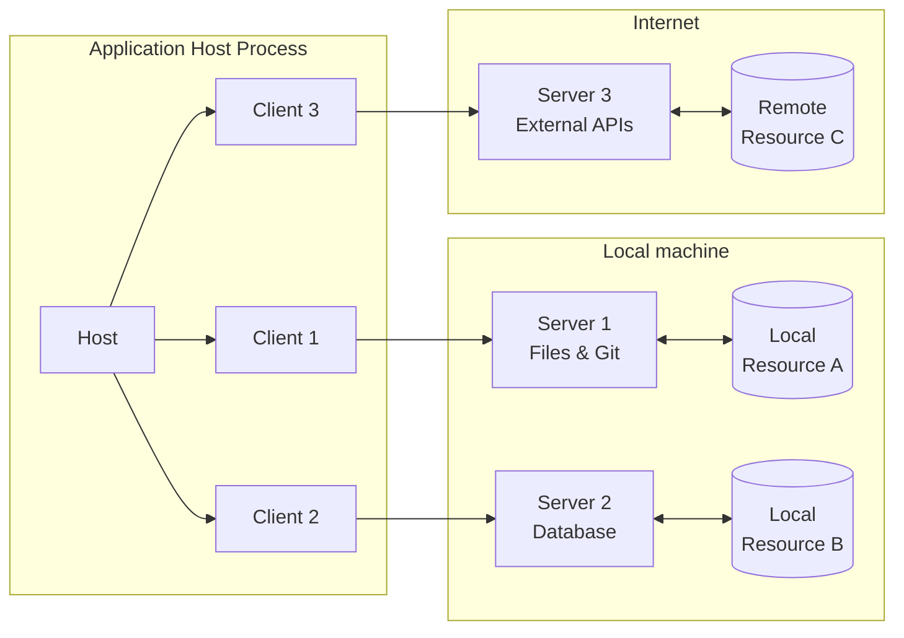
```mermaid
graph LR
    subgraph "Application Host Process"
        H[Host]
        C1[Client 1]
        C2[Client 2]
        C3[Client 3]
        H --> C1
        H --> C2
        H --> C3
    end

    subgraph "Local machine"
        S1[Server 1<br>Files & Git]
        S2[Server 2<br>Database]
        R1[("Local<br>Resource A")]
        R2[("Local<br>Resource B")]

        C1 --> S1
        C2 --> S2
        S1 <--> R1
        S2 <--> R2
    end

    subgraph "Internet"
        S3[Server 3<br>External APIs]
        R3[("Remote<br>Resource C")]

        C3 --> S3
        S3 <--> R3
    end
```

### Host
The host process acts as the container and coordinator:
- Creates and manages multiple client instances
- Controls client connection permissions and lifecycle
- Enforces security policies and consent requirements
- Handles user authorization decisions
- Coordinates AI/LLM integration and sampling
- Manages context aggregation across clients

### Clients
Each client is created by the host and maintains an isolated server connection:
- Establishes one stateful session per server
- Handles protocol negotiation and capability exchange
- Routes protocol messages bidirectionally
- Manages subscriptions and notifications
- Maintains security boundaries between servers

A host application creates and manages multiple clients, with each client having a 1:1 relationship with a particular server.

### Servers
Servers provide specialized context and capabilities:
- Expose resources, tools and prompts via MCP primitives
- Operate independently with focused responsibilities
- Request sampling through client interfaces
- Must respect security constraints
- Can be local processes or remote services

## Design Principles

MCP is built on several key design principles that inform its architecture and implementation:

1. **Servers should be extremely easy to build**
    - Host applications handle complex orchestration responsibilities
    - Servers focus on specific, well-defined capabilities
    - Simple interfaces minimize implementation overhead
    - Clear separation enables maintainable code

2. **Servers should be highly composable**
    - Each server provides focused functionality in isolation
    - Multiple servers can be combined seamlessly
    - Shared protocol enables interoperability
    - Modular design supports extensibility

3. **Servers should not be able to read the whole conversation, nor "see into" other servers**
    - Servers receive only necessary contextual information
    - Full conversation history stays with the host
    - Each server connection maintains isolation
    - Cross-server interactions are controlled by the host
    - Host process enforces security boundaries

4. **Features can be added to servers and clients progressively**
    - Core protocol provides minimal required functionality
    - Additional capabilities can be negotiated as needed
    - Servers and clients evolve independently
    - Protocol designed for future extensibility
    - Backwards compatibility is maintained

## Message Types
MCP defines three core message types based on [JSON-RPC 2.0](https://www.jsonrpc.org/specification):

- **Requests**: Bidirectional messages with method and parameters expecting a response
- **Responses**: Successful results or errors matching specific request IDs
- **Notifications**: One-way messages requiring no response

Each message type follows the JSON-RPC 2.0 specification for structure and delivery semantics.

## Capability Negotiation

The Model Context Protocol uses a capability-based negotiation system where clients and servers explicitly declare their supported features during initialization. Capabilities determine which protocol features and primitives are available during a session.

- Servers declare capabilities like resource subscriptions, tool support, and prompt templates
- Clients declare capabilities like sampling support and notification handling
- Both parties must respect declared capabilities throughout the session
- Additional capabilities can be negotiated through extensions to the protocol

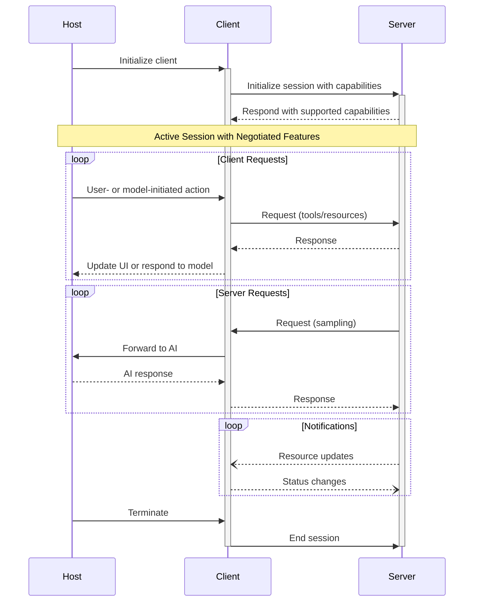
```mermaid
sequenceDiagram
    participant Host
    participant Client
    participant Server

    Host->>+Client: Initialize client
    Client->>+Server: Initialize session with capabilities
    Server-->>Client: Respond with supported capabilities

    Note over Host,Server: Active Session with Negotiated Features

    loop Client Requests
        Host->>Client: User- or model-initiated action
        Client->>Server: Request (tools/resources)
        Server-->>Client: Response
        Client-->>Host: Update UI or respond to model
    end

    loop Server Requests
        Server->>Client: Request (sampling)
        Client->>Host: Forward to AI
        Host-->>Client: AI response
        Client-->>Server: Response
    end

    loop Notifications
        Server--)Client: Resource updates
        Client--)Server: Status changes
    end

    Host->>Client: Terminate
    Client->>-Server: End session
    deactivate Server
```

Each capability unlocks specific protocol features for use during the session. For example:
- Implemented [server features]() must be advertised in the server's capabilities
- Emitting resource subscription notifications requires the server to declare subscription support
- Tool invocation requires the server to declare tool capabilities
- [Sampling]() requires the client to declare support in its capabilities

This capability negotiation ensures clients and servers have a clear understanding of supported functionality while maintaining protocol extensibility.

================
File: docs/mcp-specs/specification/basic/utilities/_index.md
================
---
title: Utilities
---


**Protocol Revision**: 


These optional features enhance the base protocol functionality with various utilities.


  
  
  


================
File: docs/mcp-specs/specification/basic/utilities/cancellation.md
================
---
title: Cancellation
weight: 10
---


**Protocol Revision**: 


The Model Context Protocol (MCP) supports optional cancellation of in-progress requests through notification messages. Either side can send a cancellation notification to indicate that a previously-issued request should be terminated.

## Cancellation Flow

When a party wants to cancel an in-progress request, it sends a `notifications/cancelled` notification containing:

- The ID of the request to cancel
- An optional reason string that can be logged or displayed

```json
{
  "jsonrpc": "2.0",
  "method": "notifications/cancelled",
  "params": {
    "requestId": "123",
    "reason": "User requested cancellation"
  }
}
```

## Behavior Requirements

1. Cancellation notifications **MUST** only reference requests that:
   - Were previously issued in the same direction
   - Are believed to still be in-progress
2. The `initialize` request **MUST NOT** be cancelled by clients
3. Receivers of cancellation notifications **SHOULD**:
   - Stop processing the cancelled request
   - Free associated resources
   - Not send a response for the cancelled request
4. Receivers **MAY** ignore cancellation notifications if:
   - The referenced request is unknown
   - Processing has already completed
   - The request cannot be cancelled
5. The sender of the cancellation notification **SHOULD** ignore any response to the request that arrives afterward

## Timing Considerations

Due to network latency, cancellation notifications may arrive after request processing has completed, and potentially after a response has already been sent.

Both parties **MUST** handle these race conditions gracefully:

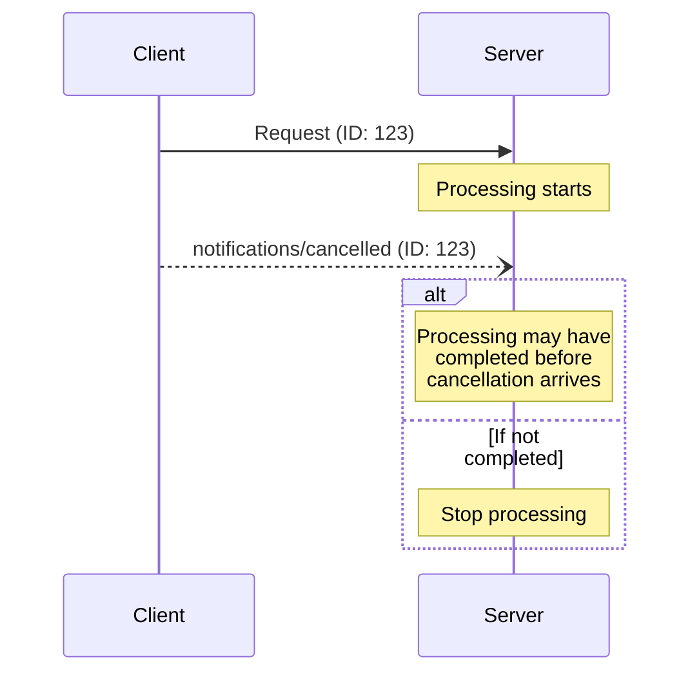
```mermaid
sequenceDiagram
   participant Client
   participant Server

   Client->>Server: Request (ID: 123)
   Note over Server: Processing starts
   Client--)Server: notifications/cancelled (ID: 123)
   alt 
      Note over Server: Processing may have<br/>completed before<br/>cancellation arrives
   else If not completed
      Note over Server: Stop processing
   end
```

## Implementation Notes

- Both parties **SHOULD** log cancellation reasons for debugging
- Application UIs **SHOULD** indicate when cancellation is requested

## Error Handling

Invalid cancellation notifications **SHOULD** be ignored:

- Unknown request IDs
- Already completed requests
- Malformed notifications

This maintains the "fire and forget" nature of notifications while allowing for race conditions in asynchronous communication.

================
File: docs/mcp-specs/specification/basic/utilities/ping.md
================
---
title: Ping
weight: 5
---


**Protocol Revision**: 


The Model Context Protocol includes an optional ping mechanism that allows either party to verify that their counterpart is still responsive and the connection is alive.

## Overview

The ping functionality is implemented through a simple request/response pattern. Either the client or server can initiate a ping by sending a `ping` request.

## Message Format

A ping request is a standard JSON-RPC request with no parameters:

```json
{
  "jsonrpc": "2.0",
  "id": "123",
  "method": "ping"
}
```

## Behavior Requirements

1. The receiver **MUST** respond promptly with an empty response:

```json
{
  "jsonrpc": "2.0",
  "id": "123",
  "result": {}
}
```

2. If no response is received within a reasonable timeout period, the sender **MAY**:
   - Consider the connection stale
   - Terminate the connection
   - Attempt reconnection procedures

## Usage Patterns

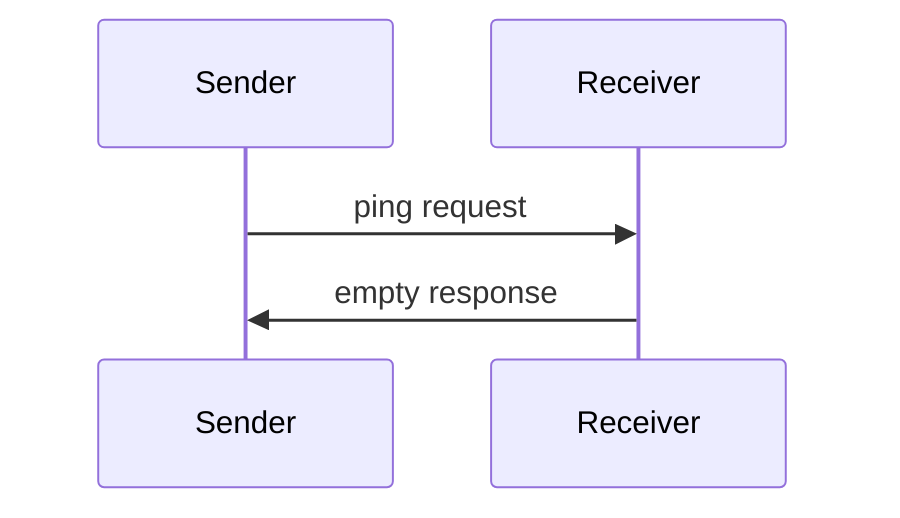
```mermaid
sequenceDiagram
    participant Sender
    participant Receiver

    Sender->>Receiver: ping request
    Receiver->>Sender: empty response
```

## Implementation Considerations

- Implementations **SHOULD** periodically issue pings to detect connection health
- The frequency of pings **SHOULD** be configurable
- Timeouts **SHOULD** be appropriate for the network environment
- Excessive pinging **SHOULD** be avoided to reduce network overhead

## Error Handling

- Timeouts **SHOULD** be treated as connection failures
- Multiple failed pings **MAY** trigger connection reset
- Implementations **SHOULD** log ping failures for diagnostics

================
File: docs/mcp-specs/specification/basic/utilities/progress.md
================
---
title: Progress
weight: 30
---

**Protocol Revision**: 


The Model Context Protocol (MCP) supports optional progress tracking for long-running operations through notification messages. Either side can send progress notifications to provide updates about operation status.

## Progress Flow

When a party wants to _receive_ progress updates for a request, it includes a `progressToken` in the request metadata.

* Progress tokens **MUST** be a string or integer value
* Progress tokens can be chosen by the sender using any means, but **MUST** be unique across all active requests.

```json
{
  "jsonrpc": "2.0",
  "id": 1,
  "method": "some_method",
  "params": {
    "_meta": {
      "progressToken": "abc123"
    }
  }
}
```

The receiver **MAY** then send progress notifications containing:

- The original progress token
- The current progress value so far
- An optional "total" value

```json
{
  "jsonrpc": "2.0",
  "method": "notifications/progress",
  "params": {
    "progressToken": "abc123",
    "progress": 50,
    "total": 100
  }
}
```

* The `progress` value **MUST** increase with each notification, even if the total is unknown.
* The `progress` and the `total` values **MAY** be floating point.

## Behavior Requirements

1. Progress notifications **MUST** only reference tokens that:
   - Were provided in an active request
   - Are associated with an in-progress operation

2. Receivers of progress requests **MAY**:
   - Choose not to send any progress notifications
   - Send notifications at whatever frequency they deem appropriate
   - Omit the total value if unknown

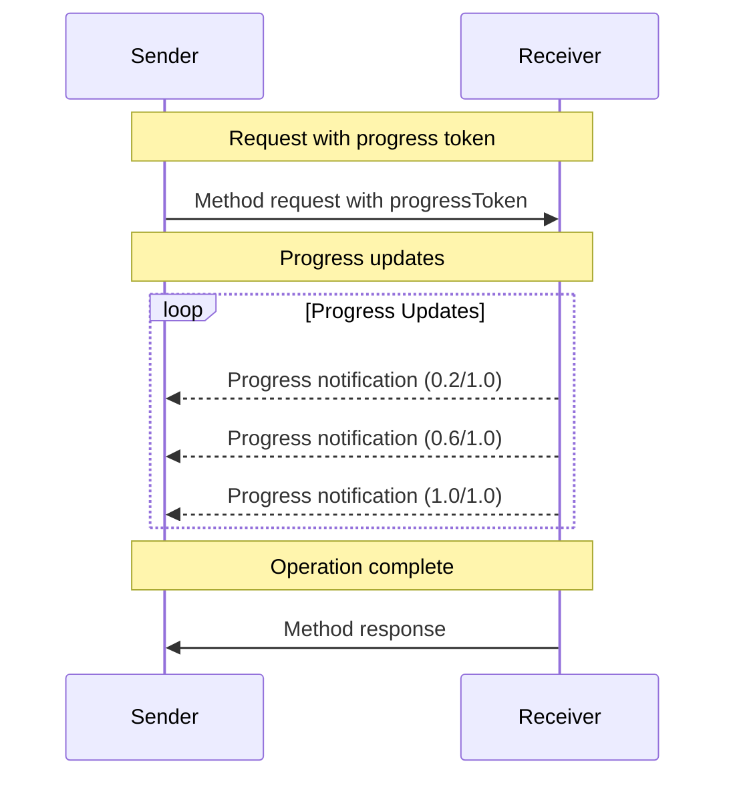
```mermaid
sequenceDiagram
    participant Sender
    participant Receiver

    Note over Sender,Receiver: Request with progress token
    Sender->>Receiver: Method request with progressToken

    Note over Sender,Receiver: Progress updates
    loop Progress Updates
        Receiver-->>Sender: Progress notification (0.2/1.0)
        Receiver-->>Sender: Progress notification (0.6/1.0)
        Receiver-->>Sender: Progress notification (1.0/1.0)
    end

    Note over Sender,Receiver: Operation complete
    Receiver->>Sender: Method response
```

## Implementation Notes

- Senders and receivers **SHOULD** track active progress tokens
- Both parties **SHOULD** implement rate limiting to prevent flooding
- Progress notifications **MUST** stop after completion

================
File: docs/mcp-specs/specification/basic/index.md
================
---
title: Base Protocol
cascade:
  type: docs
weight: 2
---


**Protocol Revision**: 


All messages between MCP clients and servers **MUST** follow the [JSON-RPC 2.0](https://www.jsonrpc.org/specification) specification. The protocol defines three fundamental types of messages:

| Type           | Description                            | Requirements                           |
|----------------|----------------------------------------|----------------------------------------|
| `Requests`     | Messages sent to initiate an operation | Must include unique ID and method name |
| `Responses`    | Messages sent in reply to requests     | Must include same ID as request        |
| `Notifications`| One-way messages with no reply         | Must not include an ID                 |

**Responses** are further sub-categorized as either **successful results** or **errors**. Results can follow any JSON object structure, while errors must include an error code and message at minimum.

## Protocol Layers

The Model Context Protocol consists of several key components that work together:

- **Base Protocol**: Core JSON-RPC message types
- **Lifecycle Management**: Connection initialization, capability negotiation, and session control
- **Server Features**: Resources, prompts, and tools exposed by servers
- **Client Features**: Sampling and root directory lists provided by clients
- **Utilities**: Cross-cutting concerns like logging and argument completion

All implementations **MUST** support the base protocol and lifecycle management components. Other components **MAY** be implemented based on the specific needs of the application.

These protocol layers establish clear separation of concerns while enabling rich interactions between clients and servers. The modular design allows implementations to support exactly the features they need.

See the following pages for more details on the different components:


  
  
  
  
  
  


## Auth

Authentication and authorization are not currently part of the core MCP specification, but we are considering ways to introduce them in future. Join us in [GitHub Discussions](https://github.com/modelcontextprotocol/specification/discussions) to help shape the future of the protocol!

Clients and servers **MAY** negotiate their own custom authentication and authorization strategies.

## Schema

The full specification of the protocol is defined as a [TypeScript schema](http://github.com/modelcontextprotocol/specification/tree/main/schema/schema.ts). This is the source of truth for all protocol messages and structures.

There is also a [JSON Schema](http://github.com/modelcontextprotocol/specification/tree/main/schema/schema.json), which is automatically generated from the TypeScript source of truth, for use with various automated tooling.

================
File: docs/mcp-specs/specification/basic/lifecycle.md
================
---
title: Lifecycle
type: docs
weight: 30
---


**Protocol Revision**: 


The Model Context Protocol (MCP) defines a rigorous lifecycle for client-server connections that ensures proper capability negotiation and state management.

1. **Initialization**: Capability negotiation and protocol version agreement
2. **Operation**: Normal protocol communication
3. **Shutdown**: Graceful termination of the connection

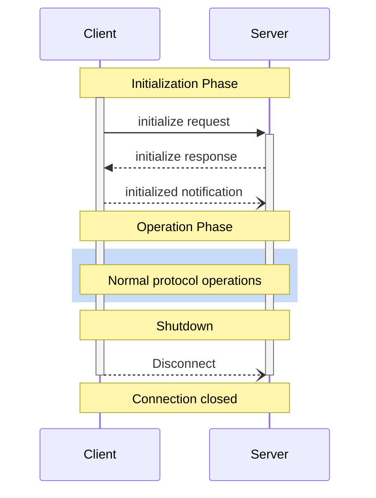
```mermaid
sequenceDiagram
    participant Client
    participant Server

    Note over Client,Server: Initialization Phase
    activate Client
    Client->>+Server: initialize request
    Server-->>Client: initialize response
    Client--)Server: initialized notification

    Note over Client,Server: Operation Phase
    rect rgb(200, 220, 250)
        note over Client,Server: Normal protocol operations
    end

    Note over Client,Server: Shutdown
    Client--)-Server: Disconnect
    deactivate Server
    Note over Client,Server: Connection closed
```

## Lifecycle Phases

### Initialization

The initialization phase **MUST** be the first interaction between client and server. During this phase, the client and server:

- Establish protocol version compatibility
- Exchange and negotiate capabilities
- Share implementation details

The client **MUST** initiate this phase by sending an `initialize` request containing:

- Protocol version supported
- Client capabilities
- Client implementation information

```json
{
  "jsonrpc": "2.0",
  "id": 1,
  "method": "initialize",
  "params": {
    "protocolVersion": "2024-11-05",
    "capabilities": {
      "roots": {
        "listChanged": true
      },
      "sampling": {}
    },
    "clientInfo": {
      "name": "ExampleClient",
      "version": "1.0.0"
    }
  }
}
```

The server **MUST** respond with its own capabilities and information:

```json
{
  "jsonrpc": "2.0",
  "id": 1,
  "result": {
    "protocolVersion": "2024-11-05",
    "capabilities": {
      "logging": {},
      "prompts": {
        "listChanged": true
      },
      "resources": {
        "subscribe": true,
        "listChanged": true
      },
      "tools": {
        "listChanged": true
      }
    },
    "serverInfo": {
      "name": "ExampleServer",
      "version": "1.0.0"
    }
  }
}
```

After successful initialization, the client **MUST** send an `initialized` notification to indicate it is ready to begin normal operations:

```json
{
  "jsonrpc": "2.0",
  "method": "initialized"
}
```

* The client **SHOULD NOT** send requests other than [pings]() before the server has responded to the `initialize` request.
* The server **SHOULD NOT** send requests other than [pings]() and [logging]() before receiving the `initialized` notification.

#### Version Negotiation

In the `initialize` request, the client **MUST** send a protocol version it supports. This **SHOULD** be the _latest_ version supported by the client.

If the server supports the requested protocol version, it **MUST** respond with the same version. Otherwise, the server **MUST** respond with another protocol version it supports. This **SHOULD** be the _latest_ version supported by the server.

If the client does not support the version in the server's response, it **SHOULD** disconnect.

#### Capability Negotiation

Client and server capabilities establish which optional protocol features will be available during the session.

Key capabilities include:

| Category | Capability     | Description |
|----------|--------------- |-------------|
| Client   | `roots`        | Ability to provide filesystem [roots]() |
| Client   | `sampling`     | Support for LLM [sampling]() requests |
| Client   | `experimental` | Describes support for non-standard experimental features |
| Server   | `prompts`      | Offers [prompt templates]() |
| Server   | `resources`    | Provides readable [resources]() |
| Server   | `tools`        | Exposes callable [tools]() |
| Server   | `logging`      | Emits structured [log messages]() |
| Server   | `experimental` | Describes support for non-standard experimental features |

Capability objects can describe sub-capabilities like:
- `listChanged`: Support for list change notifications (for prompts, resources, and tools)
- `subscribe`: Support for subscribing to individual items' changes (resources only)

### Operation

During the operation phase, the client and server exchange messages according to the negotiated capabilities.

Both parties **SHOULD**:

- Respect the negotiated protocol version
- Only use capabilities that were successfully negotiated

### Shutdown

During the shutdown phase, one side (usually the client) cleanly terminates the protocol connection. No specific shutdown messages are defined—instead, the underlying transport mechanism should be used to signal connection termination:

#### stdio

For the stdio [transport](), the client **SHOULD** initiate shutdown by:

1. First, closing the input stream to the child process (the server)
2. Waiting for the server to exit, or sending `SIGTERM` if the server does not exit within a reasonable time
3. Sending `SIGKILL` if the server does not exit within a reasonable time after `SIGTERM`

The server **MAY** initiate shutdown by closing its output stream to the client and exiting.

#### HTTP

For HTTP [transports](), shutdown is indicated by closing the associated HTTP connection(s).

## Error Handling

Implementations **SHOULD** be prepared to handle these error cases:

- Protocol version mismatch
- Failure to negotiate required capabilities
- Initialize request timeout
- Shutdown timeout

Implementations **SHOULD** implement appropriate timeouts for all requests, to prevent hung connections and resource exhaustion.

Example initialization error:
```json
{
  "jsonrpc": "2.0",
  "id": 1,
  "error": {
    "code": -32602,
    "message": "Unsupported protocol version",
    "data": {
      "supported": ["2024-11-05"],
      "requested": "1.0.0"
    }
  }
}
```

================
File: docs/mcp-specs/specification/basic/messages.md
================
---
title: Messages
type: docs
weight: 20
---

**Protocol Revision**: 


All messages in MCP **MUST** follow the [JSON-RPC 2.0](https://www.jsonrpc.org/specification) specification. The protocol defines three types of messages:

## Requests

Requests are sent from the client to the server or vice versa.

```typescript
{
  jsonrpc: "2.0";
  id: string | number;
  method: string;
  params?: {
    [key: string]: unknown;
  };
}
```

* Requests **MUST** include a string or integer ID.
* Unlike base JSON-RPC, the ID **MUST NOT** be `null`.
* The request ID **MUST NOT** have been previously used by the requestor within the same session.

## Responses

Responses are sent in reply to requests.

```typescript
{
  jsonrpc: "2.0";
  id: string | number;
  result?: {
    [key: string]: unknown;
  }
  error?: {
    code: number;
    message: string;
    data?: unknown;
  }
}
```

* Responses **MUST** include the same ID as the request they correspond to.
* Either a `result` or an `error` **MUST** be set. A response **MUST NOT** set both.
* Error codes **MUST** be integers.

## Notifications

Notifications are sent from the client to the server or vice versa. They do not expect a response.

```typescript
{
  jsonrpc: "2.0";
  method: string;
  params?: {
    [key: string]: unknown;
  };
}
```

* Notifications **MUST NOT** include an ID.

================
File: docs/mcp-specs/specification/basic/transports.md
================
---
title: Transports
type: docs
weight: 40
---

**Protocol Revision**: 


MCP currently defines two standard transport mechanisms for client-server communication:
1. [stdio](#stdio), communication over standard in and standard out
2. [HTTP with Server-Sent Events](#http-with-sse) (SSE)

Clients **SHOULD** support stdio whenever possible.

It is also possible for clients and servers to implement [custom transports](#custom-transports) in a pluggable fashion.

## stdio
In the **stdio** transport:
* The client launches the MCP server as a subprocess.
* The server receives JSON-RPC messages on its standard input (`stdin`) and writes responses to its standard output (`stdout`).
* Messages are delimited by newlines, and **MUST NOT** contain embedded newlines.
* The server **MAY** write UTF-8 strings to its standard error (`stderr`) for logging purposes. Clients **MAY** capture, forward, or ignore this logging.
* The server **MUST NOT** write anything to its `stdout` that is not a valid MCP message.
* The client **MUST NOT** write anything to the server's `stdin` that is not a valid MCP message.

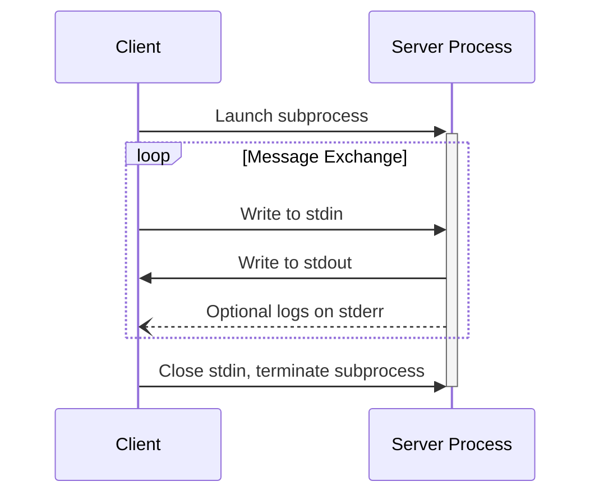
```mermaid
sequenceDiagram
    participant Client
    participant Server Process

    Client->>+Server Process: Launch subprocess
    loop Message Exchange
        Client->>Server Process: Write to stdin
        Server Process->>Client: Write to stdout
        Server Process--)Client: Optional logs on stderr
    end
    Client->>Server Process: Close stdin, terminate subprocess
    deactivate Server Process
```

## HTTP with SSE
In the **SSE** transport, the server operates as an independent process that can handle multiple client connections.

The server **MUST** provide two endpoints:

1. An SSE endpoint, for clients to establish a connection and receive messages from the server
2. A regular HTTP POST endpoint for clients to send messages to the server

When a client connects, the server **MUST** send an `endpoint` event containing a URI for the client to use for sending messages. All subsequent client messages **MUST** be sent as HTTP POST requests to this endpoint.

Server messages are sent as SSE `message` events, with the message content encoded as JSON in the event data.

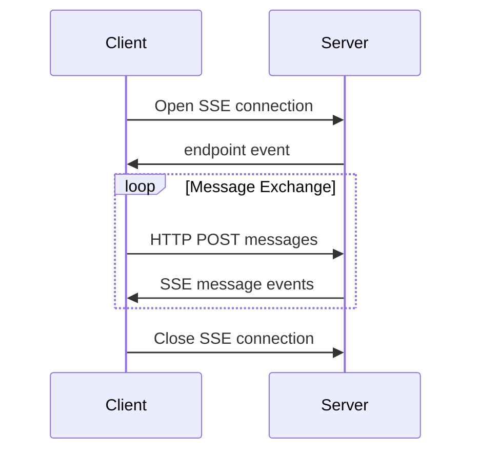
```mermaid
sequenceDiagram
    participant Client
    participant Server

    Client->>Server: Open SSE connection
    Server->>Client: endpoint event
    loop Message Exchange
        Client->>Server: HTTP POST messages
        Server->>Client: SSE message events
    end
    Client->>Server: Close SSE connection
```

## Custom Transports

Clients and servers **MAY** implement additional custom transport mechanisms to suit their specific needs. The protocol is transport-agnostic and can be implemented over any communication channel that supports bidirectional message exchange.

Implementers who choose to support custom transports **MUST** ensure they preserve the JSON-RPC message format and lifecycle requirements defined by MCP. Custom transports **SHOULD** document their specific connection establishment and message exchange patterns to aid interoperability.

================
File: docs/mcp-specs/specification/basic/versioning.md
================
---
title: Versioning
type: docs
weight: 80
---

The Model Context Protocol uses string-based version identifiers following the format `YYYY-MM-DD`, to indicate the last date backwards incompatible changes were made.

The current protocol version is ****. [See all revisions]().


  The protocol version will _not_ be incremented when the protocol is updated, as long as the changes maintain backwards compatibility. This allows for incremental improvements while preserving interoperability.


Version negotiation happens during [initialization](). Clients and servers **MAY** support multiple protocol versions simultaneously, but they **MUST** agree on a single version to use for the session.

The protocol provides appropriate error handling if version negotiation fails, allowing clients to gracefully terminate connections when they cannot find a version compatible with the server.

================
File: docs/mcp-specs/specification/client/index.md
================
---
title: Client Features
cascade:
  type: docs
weight: 4
---


**Protocol Revision**: 


Clients can implement additional features to enrich connected MCP servers:
  

  
  


================
File: docs/mcp-specs/specification/client/roots.md
================
---
title: Roots
type: docs
weight: 40
---


**Protocol Revision**: 


The Model Context Protocol (MCP) provides a standardized way for clients to expose filesystem "roots" to servers. Roots define the boundaries of where servers can operate within the filesystem, allowing them to understand which directories and files they have access to. Servers can request the list of roots from supporting clients and receive notifications when that list changes.

## User Interaction Model

Roots in MCP are typically exposed through workspace or project configuration interfaces.

For example, implementations could offer a workspace/project picker that allows users to select directories and files the server should have access to. This can be combined with automatic workspace detection from version control systems or project files.

However, implementations are free to expose roots through any interface pattern that suits their needs&mdash;the protocol itself does not mandate any specific user interaction model.

## Capabilities

Clients that support prompts **MUST** declare the `roots` capability during [initialization]():

```json
{
  "capabilities": {
    "roots": {
      "listChanged": true
    }
  }
}
```

`listChanged` indicates whether the client will emit notifications when the list of roots changes.

## Protocol Messages

### Listing Roots

To retrieve roots, servers send a `roots/list` request:

**Request:**
```json
{
  "jsonrpc": "2.0",
  "id": 1,
  "method": "roots/list"
}
```

**Response:**
```json
{
  "jsonrpc": "2.0",
  "id": 1,
  "result": {
    "roots": [
      {
        "uri": "file:///home/user/projects/myproject",
        "name": "My Project"
      }
    ]
  }
}
```

### Root List Changes

When roots change, clients that support `listChanged` MUST send a notification:

```json
{
  "jsonrpc": "2.0",
  "method": "notifications/roots/list_changed"
}
```

## Message Flow

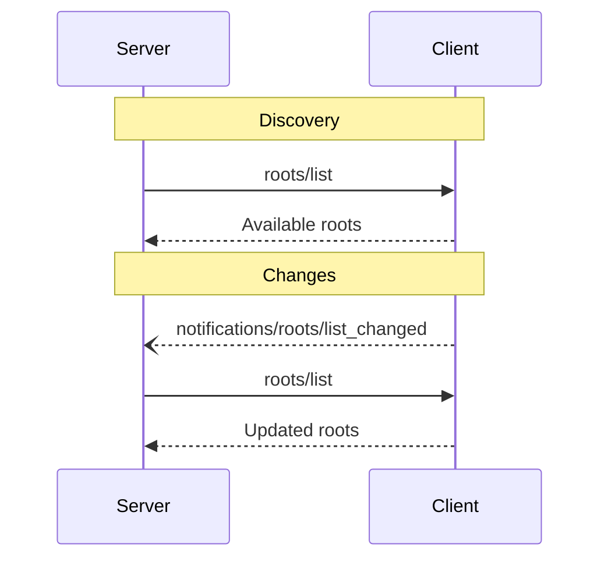
```mermaid
sequenceDiagram
    participant Server
    participant Client

    Note over Server,Client: Discovery
    Server->>Client: roots/list
    Client-->>Server: Available roots

    Note over Server,Client: Changes
    Client--)Server: notifications/roots/list_changed
    Server->>Client: roots/list
    Client-->>Server: Updated roots
```

## Data Types

### Root

A root definition includes:

- `uri`: Unique identifier for the root. This **MUST** be a `file://` URI in the current specification.
- `name`: Optional human-readable name for display purposes.

Example roots for different use cases:

#### Project Directory
```json
{
  "uri": "file:///home/user/projects/myproject",
  "name": "My Project"
}
```

#### Multiple Repositories
```json
[
  {
    "uri": "file:///home/user/repos/frontend",
    "name": "Frontend Repository"
  },
  {
    "uri": "file:///home/user/repos/backend",
    "name": "Backend Repository"
  }
]
```

## Error Handling

Clients SHOULD return standard JSON-RPC errors for common failure cases:

- Client does not support roots: `-32601` (Method not found)
- Internal errors: `-32603`

Example error:
```json
{
  "jsonrpc": "2.0",
  "id": 1,
  "error": {
    "code": -32601,
    "message": "Roots not supported",
    "data": {
      "reason": "Client does not have roots capability"
    }
  }
}
```

## Security Considerations

1. Clients **MUST**:
   - Only expose roots with appropriate permissions
   - Validate all root URIs to prevent path traversal
   - Implement proper access controls
   - Monitor root accessibility

2. Servers **SHOULD**:
   - Handle cases where roots become unavailable
   - Respect root boundaries during operations
   - Validate all paths against provided roots

## Implementation Guidelines

1. Clients **SHOULD**:
   - Prompt users for consent before exposing roots to servers
   - Provide clear user interfaces for root management
   - Validate root accessibility before exposing
   - Monitor for root changes

2. Servers **SHOULD**:
   - Check for roots capability before usage
   - Handle root list changes gracefully
   - Respect root boundaries in operations
   - Cache root information appropriately

================
File: docs/mcp-specs/specification/client/sampling.md
================
---
title: Sampling
type: docs
weight: 40
---


**Protocol Revision**: 


The Model Context Protocol (MCP) provides a standardized way for servers to request LLM sampling ("completions" or "generations") from language models via clients. This flow allows clients to maintain control over model access, selection, and permissions while enabling servers to leverage AI capabilities&mdash;with no server API keys necessary. Servers can request text or image-based interactions and optionally include context from MCP servers in their prompts.

## User Interaction Model

Sampling in MCP allows servers to implement agentic behaviors, by enabling LLM calls to occur _nested_ inside other MCP server features.

Implementations are free to expose sampling through any interface pattern that suits their needs&mdash;the protocol itself does not mandate any specific user interaction model.


  For trust & safety and security, there **SHOULD** always be a human in the loop with the ability to deny sampling requests.
  
  Applications **SHOULD**:
  * Provide UI that makes it easy and intuitive to review sampling requests
  * Allow users to view and edit prompts before sending
  * Present generated responses for review before delivery


## Capabilities

Clients that support sampling **MUST** declare the `sampling` capability during [initialization]():

```json
{
  "capabilities": {
    "sampling": {}
  }
}
```

## Protocol Messages

### Creating Messages

To request a language model generation, servers send a `sampling/createMessage` request:

**Request:**
```json
{
  "jsonrpc": "2.0",
  "id": 1,
  "method": "sampling/createMessage",
  "params": {
    "messages": [
      {
        "role": "user",
        "content": {
          "type": "text",
          "text": "What is the capital of France?"
        }
      }
    ],
    "modelPreferences": {
      "hints": [
        {
          "name": "claude-3-sonnet"
        }
      ],
      "intelligencePriority": 0.8,
      "speedPriority": 0.5
    },
    "systemPrompt": "You are a helpful assistant.",
    "maxTokens": 100
  }
}
```

**Response:**
```json
{
  "jsonrpc": "2.0",
  "id": 1,
  "result": {
    "role": "assistant",
    "content": {
      "type": "text",
      "text": "The capital of France is Paris."
    },
    "model": "claude-3-sonnet-20240307",
    "stopReason": "endTurn"
  }
}
```

## Message Flow

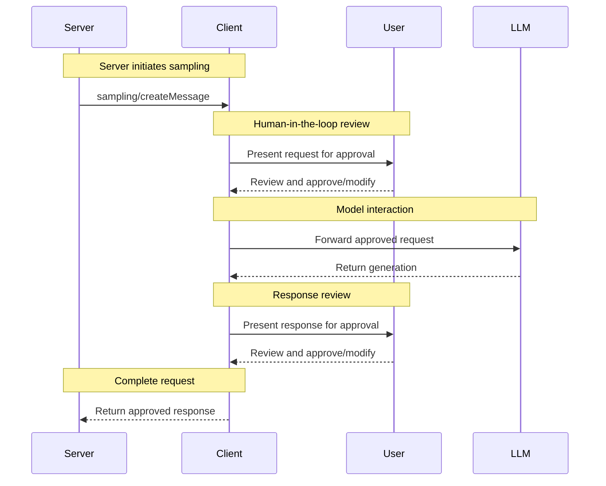
```mermaid
sequenceDiagram
    participant Server
    participant Client
    participant User
    participant LLM

    Note over Server,Client: Server initiates sampling
    Server->>Client: sampling/createMessage

    Note over Client,User: Human-in-the-loop review
    Client->>User: Present request for approval
    User-->>Client: Review and approve/modify

    Note over Client,LLM: Model interaction
    Client->>LLM: Forward approved request
    LLM-->>Client: Return generation

    Note over Client,User: Response review
    Client->>User: Present response for approval
    User-->>Client: Review and approve/modify

    Note over Server,Client: Complete request
    Client-->>Server: Return approved response
```

## Data Types

### Messages

Sampling messages can contain:

#### Text Content
```json
{
  "type": "text",
  "text": "The message content"
}
```

#### Image Content
```json
{
  "type": "image",
  "data": "base64-encoded-image-data",
  "mimeType": "image/jpeg"
}
```

### Model Preferences

Model selection in MCP requires careful abstraction since servers and clients may use different AI providers with distinct model offerings. A server cannot simply request a specific model by name since the client may not have access to that exact model or may prefer to use a different provider's equivalent model.

To solve this, MCP implements a preference system that combines abstract capability priorities with optional model hints:

#### Capability Priorities

Servers express their needs through three normalized priority values (0-1):

- `costPriority`: How important is minimizing costs? Higher values prefer cheaper models.
- `speedPriority`: How important is low latency? Higher values prefer faster models.
- `intelligencePriority`: How important are advanced capabilities? Higher values prefer more capable models.

#### Model Hints

While priorities help select models based on characteristics, `hints` allow servers to suggest specific models or model families:

- Hints are treated as substrings that can match model names flexibly
- Multiple hints are evaluated in order of preference
- Clients **MAY** map hints to equivalent models from different providers
- Hints are advisory&mdash;clients make final model selection

For example:
```json
{
  "hints": [
    {"name": "claude-3-sonnet"},  // Prefer Sonnet-class models
    {"name": "claude"}            // Fall back to any Claude model
  ],
  "costPriority": 0.3,            // Cost is less important
  "speedPriority": 0.8,           // Speed is very important
  "intelligencePriority": 0.5     // Moderate capability needs
}
```

The client processes these preferences to select an appropriate model from its available options. For instance, if the client doesn't have access to Claude models but has Gemini, it might map the sonnet hint to `gemini-1.5-pro` based on similar capabilities.

## Error Handling

Clients **SHOULD** return errors for common failure cases:

Example error:
```json
{
  "jsonrpc": "2.0",
  "id": 1,
  "error": {
    "code": -1,
    "message": "User rejected sampling request"
  }
}
```

## Security Considerations

1. Clients **SHOULD** implement user approval controls
2. Both parties **SHOULD** validate message content
3. Clients **SHOULD** respect model preference hints
4. Clients **SHOULD** implement rate limiting
5. Both parties **MUST** handle sensitive data appropriately

================
File: docs/mcp-specs/specification/contributing/index.md
================
---
title: "Contributions"
weight: 10
cascade:
  type: docs
breadcrumbs: false
---

We welcome contributions from the community! Please review our [contributing guidelines](https://github.com/modelcontextprotocol/specification/blob/main/CONTRIBUTING.md) for details on how to submit changes.

All contributors must adhere to our [Code of Conduct](https://github.com/modelcontextprotocol/specification/blob/main/CODE_OF_CONDUCT.md).

For questions and discussions, please use [GitHub Discussions](https://github.com/modelcontextprotocol/specification/discussions).

================
File: docs/mcp-specs/specification/revisions/2024-11-05.md
================
---
title: 2024-11-05 (Current)
weight: 1
---
This is the current version of the specification. This revision may continue to receive backwards compatible changes.

================
File: docs/mcp-specs/specification/revisions/index.md
================
---
title: Revisions
cascade:
  type: docs
---

This page lists the different revisions of the Model Context Protocol. See [Versioning]() for more information about how the protocol is versioned.

Revisions may be marked as:

* **Draft**: in-progress specifications, not yet ready for consumption.
* **Current**: the current protocol version, which is ready for use and may continue to receive [backwards compatible changes]().
* **Final**: past, complete specifications that will not be changed.

================
File: docs/mcp-specs/specification/server/utilities/_index.md
================
---
title: Utilities
---


**Protocol Revision**: 


These optional features can be used to enhance server functionality.


  
  
  


================
File: docs/mcp-specs/specification/server/utilities/completion.md
================
---
title: Completion
---


**Protocol Revision**: 


The Model Context Protocol (MCP) provides a standardized way for servers to offer argument autocompletion suggestions for prompts and resource URIs. This enables rich, IDE-like experiences where users receive contextual suggestions while entering argument values.

## User Interaction Model

Completion in MCP is designed to support interactive user experiences similar to IDE code completion.

For example, applications may show completion suggestions in a dropdown or popup menu as users type, with the ability to filter and select from available options.

However, implementations are free to expose completion through any interface pattern that suits their needs&mdash;the protocol itself does not mandate any specific user interaction model.

## Protocol Messages

### Requesting Completions

To get completion suggestions, clients send a `completion/complete` request specifying what is being completed through a reference type:

**Request:**
```json
{
  "jsonrpc": "2.0",
  "id": 1,
  "method": "completion/complete",
  "params": {
    "ref": {
      "type": "ref/prompt",
      "name": "code_review"
    },
    "argument": {
      "name": "language",
      "value": "py"
    }
  }
}
```

**Response:**
```json
{
  "jsonrpc": "2.0",
  "id": 1,
  "result": {
    "completion": {
      "values": ["python", "pytorch", "pyside"],
      "total": 10,
      "hasMore": true
    }
  }
}
```

### Reference Types

The protocol supports two types of completion references:

| Type | Description | Example |
|------|-------------|---------|
| `ref/prompt` | References a prompt by name | `{"type": "ref/prompt", "name": "code_review"}` |
| `ref/resource` | References a resource URI | `{"type": "ref/resource", "uri": "file:///{path}"}` |

### Completion Results

Servers return an array of completion values ranked by relevance, with:

- Maximum 100 items per response
- Optional total number of available matches
- Boolean indicating if additional results exist

## Message Flow

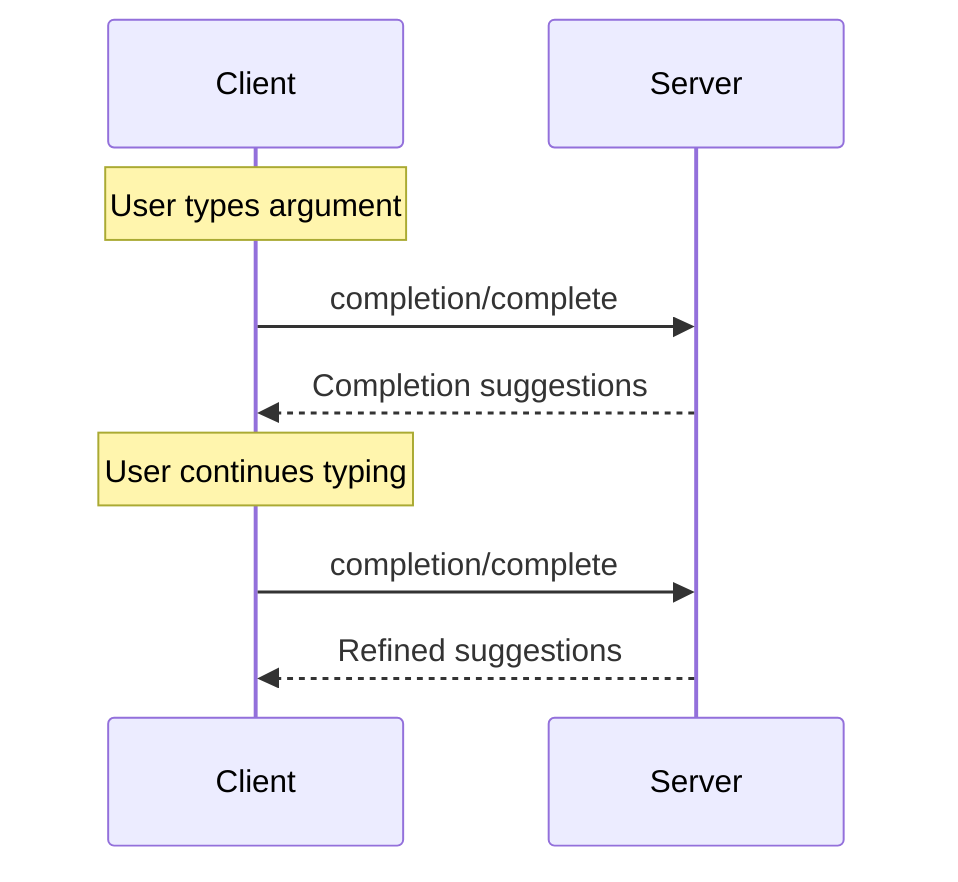
```mermaid
sequenceDiagram
    participant Client
    participant Server

    Note over Client: User types argument
    Client->>Server: completion/complete
    Server-->>Client: Completion suggestions

    Note over Client: User continues typing
    Client->>Server: completion/complete
    Server-->>Client: Refined suggestions
```

## Data Types

### CompleteRequest
- `ref`: A `PromptReference` or `ResourceReference`
- `argument`: Object containing:
  - `name`: Argument name
  - `value`: Current value

### CompleteResult
- `completion`: Object containing:
  - `values`: Array of suggestions (max 100)
  - `total`: Optional total matches
  - `hasMore`: Additional results flag

## Implementation Considerations

1. Servers **SHOULD**:
   - Return suggestions sorted by relevance
   - Implement fuzzy matching where appropriate
   - Rate limit completion requests
   - Validate all inputs

2. Clients **SHOULD**:
   - Debounce rapid completion requests
   - Cache completion results where appropriate
   - Handle missing or partial results gracefully

## Security

Implementations **MUST**:
- Validate all completion inputs
- Implement appropriate rate limiting
- Control access to sensitive suggestions
- Prevent completion-based information disclosure

================
File: docs/mcp-specs/specification/server/utilities/logging.md
================
---
title: Logging
---


**Protocol Revision**: 


The Model Context Protocol (MCP) provides a standardized way for servers to send structured log messages to clients. Clients can control logging verbosity by setting minimum log levels, with servers sending notifications containing severity levels, optional logger names, and arbitrary JSON-serializable data.

## User Interaction Model

Implementations are free to expose logging through any interface pattern that suits their needs&mdash;the protocol itself does not mandate any specific user interaction model.

## Capabilities

Servers that emit log message notifications **MUST** declare the `logging` capability:

```json
{
  "capabilities": {
    "logging": {}
  }
}
```

## Log Levels

The protocol follows the standard syslog severity levels specified in [RFC 5424](https://datatracker.ietf.org/doc/html/rfc5424#section-6.2.1):

| Level      | Description                          | Example Use Case                        |
|------------|--------------------------------------|----------------------------------------|
| debug      | Detailed debugging information       | Function entry/exit points              |
| info       | General informational messages       | Operation progress updates              |
| notice     | Normal but significant events        | Configuration changes                   |
| warning    | Warning conditions                   | Deprecated feature usage                |
| error      | Error conditions                     | Operation failures                      |
| critical   | Critical conditions                  | System component failures               |
| alert      | Action must be taken immediately     | Data corruption detected                |
| emergency  | System is unusable                   | Complete system failure                 |

## Protocol Messages

### Setting Log Level

To configure the minimum log level, clients **MAY** send a `logging/setLevel` request:

**Request:**
```json
{
  "jsonrpc": "2.0",
  "id": 1,
  "method": "logging/setLevel",
  "params": {
    "level": "info"
  }
}
```

### Log Message Notifications

Servers send log messages using `notifications/message` notifications:

```json
{
  "jsonrpc": "2.0",
  "method": "notifications/message",
  "params": {
    "level": "error",
    "logger": "database",
    "data": {
      "error": "Connection failed",
      "details": {
        "host": "localhost",
        "port": 5432
      }
    }
  }
}
```

## Message Flow

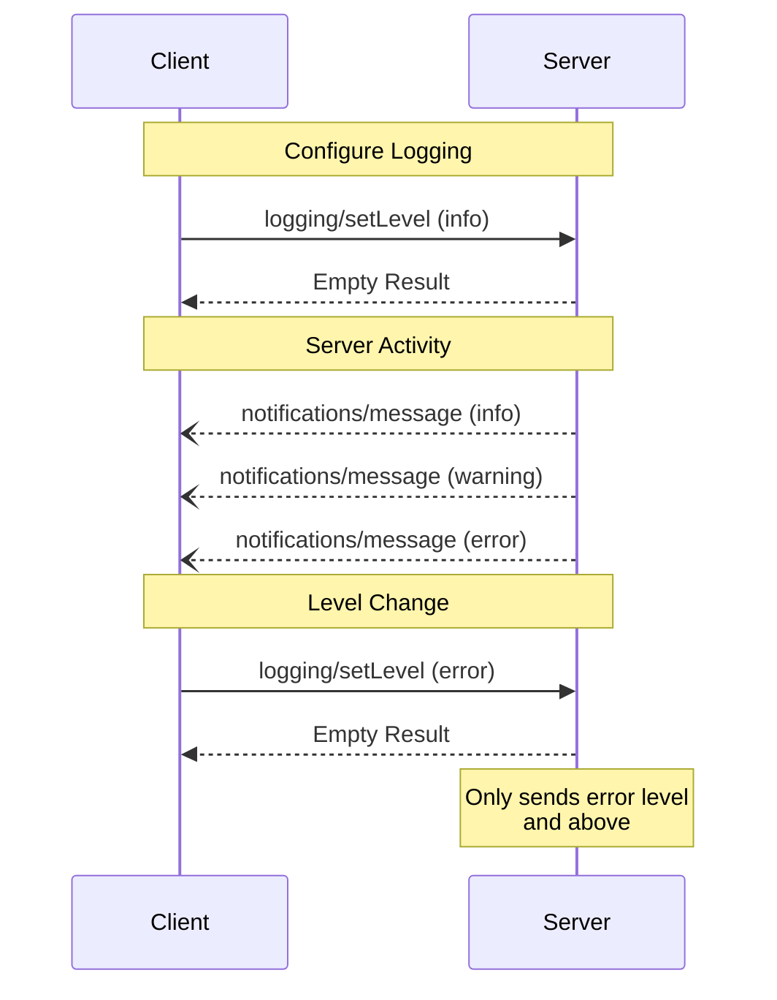
```mermaid
sequenceDiagram
    participant Client
    participant Server

    Note over Client,Server: Configure Logging
    Client->>Server: logging/setLevel (info)
    Server-->>Client: Empty Result

    Note over Client,Server: Server Activity
    Server--)Client: notifications/message (info)
    Server--)Client: notifications/message (warning)
    Server--)Client: notifications/message (error)

    Note over Client,Server: Level Change
    Client->>Server: logging/setLevel (error)
    Server-->>Client: Empty Result
    Note over Server: Only sends error level<br/>and above
```

## Error Handling

Servers **SHOULD** return standard JSON-RPC errors for common failure cases:

- Invalid log level: `-32602` (Invalid params)
- Configuration errors: `-32603` (Internal error)

## Implementation Considerations

1. Servers **SHOULD**:
   - Rate limit log messages
   - Include relevant context in data field
   - Use consistent logger names
   - Remove sensitive information

2. Clients **MAY**:
   - Present log messages in the UI
   - Implement log filtering/search
   - Display severity visually
   - Persist log messages

## Security

1. Log messages **MUST NOT** contain:
   - Credentials or secrets
   - Personal identifying information
   - Internal system details that could aid attacks

2. Implementations **SHOULD**:
   - Rate limit messages
   - Validate all data fields
   - Control log access
   - Monitor for sensitive content

================
File: docs/mcp-specs/specification/server/utilities/pagination.md
================
---
title: Pagination
---

**Protocol Revision**: 


The Model Context Protocol (MCP) supports paginating list operations that may return large result sets. Pagination allows servers to yield results in smaller chunks rather than all at once.

Pagination is especially important when connecting to external services over the internet, but also useful for local integrations to avoid performance issues with large data sets.

## Pagination Model

Pagination in MCP uses an opaque cursor-based approach, instead of numbered pages.

* The **cursor** is an opaque string token, representing a position in the result set
* **Page size** is determined by the server, and **MAY NOT** be fixed

## Response Format

Pagination starts when the server sends a **response** that includes:
- The current page of results
- An optional `nextCursor` field if more results exist

```json
{
  "jsonrpc": "2.0",
  "id": "123",
  "result": {
    "resources": [...],
    "nextCursor": "eyJwYWdlIjogM30="
  }
}
```

## Request Format

After receiving a cursor, the client can _continue_ paginating by issuing a request including that cursor:

```json
{
  "jsonrpc": "2.0",
  "method": "resources/list",
  "params": {
    "cursor": "eyJwYWdlIjogMn0="
  }
}
```

## Pagination Flow

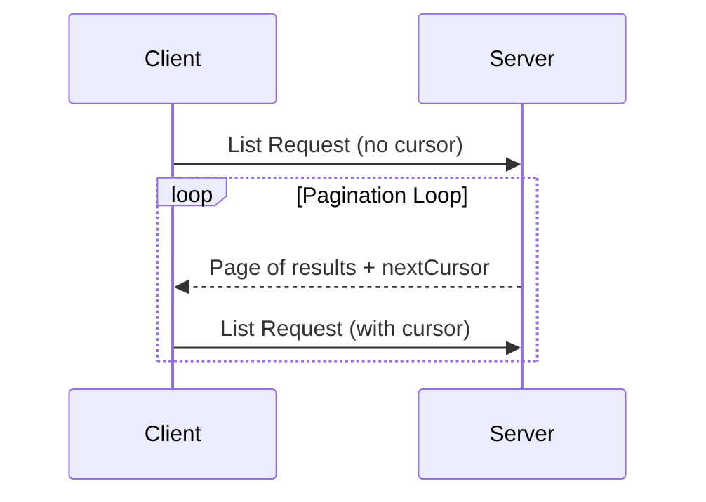
```mermaid
sequenceDiagram
    participant Client
    participant Server

    Client->>Server: List Request (no cursor)
    loop Pagination Loop
      Server-->>Client: Page of results + nextCursor
      Client->>Server: List Request (with cursor)
    end
```

## Operations Supporting Pagination

The following MCP operations support pagination:

- `resources/list` - List available resources
- `resources/templates/list` - List resource templates
- `prompts/list` - List available prompts
- `tools/list` - List available tools

## Implementation Guidelines

1. Servers **SHOULD**:
   - Provide stable cursors
   - Handle invalid cursors gracefully

2. Clients **SHOULD**:
   - Treat a missing `nextCursor` as the end of results
   - Support both paginated and non-paginated flows

3. Clients **MUST** treat cursors as opaque tokens:
   - Don't make assumptions about cursor format
   - Don't attempt to parse or modify cursors
   - Don't persist cursors across sessions

## Error Handling

Invalid cursors **SHOULD** result in an error with code -32602 (Invalid params).

================
File: docs/mcp-specs/specification/server/_index.md
================
---
title: Server Features
cascade:
  type: docs
weight: 3
---


**Protocol Revision**: 


Servers provide the fundamental building blocks for adding context to language models via MCP. These primitives enable rich interactions between clients, servers, and language models:

- **Prompts**: Pre-defined templates or instructions that guide language model interactions
- **Resources**: Structured data or content that provides additional context to the model
- **Tools**: Executable functions that allow models to perform actions or retrieve information

Each primitive can be summarized in the following control hierarchy:

| Primitive | Control                | Description                                        | Example                      |
|-----------|------------------------|----------------------------------------------------|------------------------------|
| Prompts   | User-controlled        | Interactive templates invoked by user choice       | Slash commands, menu options |
| Resources | Application-controlled | Contextual data attached and managed by the client | File contents, git history   |
| Tools     | Model-controlled       | Functions exposed to the LLM to take actions    | API POST requests, file writing   |

Explore these key primitives in more detail below:


  
  
  


================
File: docs/mcp-specs/specification/server/prompts.md
================
---
title: Prompts
weight: 10
---


**Protocol Revision**: 


The Model Context Protocol (MCP) provides a standardized way for servers to expose prompt templates to clients. Prompts allow servers to provide structured messages and instructions for interacting with language models. Clients can discover available prompts, retrieve their contents, and provide arguments to customize them.

## User Interaction Model

Prompts are designed to be **user-controlled**, meaning they are exposed from servers to clients with the intention of the user being able to explicitly select them for use.

Typically, prompts would be triggered through user-initiated commands in the user interface, which allows users to naturally discover and invoke available prompts.

For example, as slash commands:


However, implementors are free to expose prompts through any interface pattern that suits their needs&mdash;the protocol itself does not mandate any specific user interaction model.

## Capabilities

Servers that support prompts **MUST** declare the `prompts` capability during [initialization]():
```json
{
  "capabilities": {
    "prompts": {
      "listChanged": true
    }
  }
}
```

`listChanged` indicates whether the server will emit notifications when the list of available prompts changes.

## Protocol Messages

### Listing Prompts

To retrieve available prompts, clients send a `prompts/list` request. This operation supports [pagination]().

**Request:**
```json
{
  "jsonrpc": "2.0",
  "id": 1,
  "method": "prompts/list",
  "params": {
    "cursor": "optional-cursor-value"
  }
}
```

**Response:**
```json
{
  "jsonrpc": "2.0",
  "id": 1,
  "result": {
    "prompts": [
      {
        "name": "code_review",
        "description": "Asks the LLM to analyze code quality and suggest improvements",
        "arguments": [
          {
            "name": "code",
            "description": "The code to review",
            "required": true
          }
        ]
      }
    ],
    "nextCursor": "next-page-cursor"
  }
}
```

### Getting a Prompt

To retrieve a specific prompt, clients send a `prompts/get` request. Arguments may be auto-completed through [the completion API]().

**Request:**
```json
{
  "jsonrpc": "2.0",
  "id": 2,
  "method": "prompts/get",
  "params": {
    "name": "code_review",
    "arguments": {
      "code": "def hello():\n    print('world')"
    }
  }
}
```

**Response:**
```json
{
  "jsonrpc": "2.0",
  "id": 2,
  "result": {
    "description": "Code review prompt",
    "messages": [
      {
        "role": "user",
        "content": {
          "type": "text",
          "text": "Please review this Python code:\ndef hello():\n    print('world')"
        }
      }
    ]
  }
}
```

### List Changed Notification

When the list of available prompts changes, servers that declared the `listChanged` capability **SHOULD** send a notification:

```json
{
  "jsonrpc": "2.0",
  "method": "notifications/prompts/list_changed"
}
```

## Message Flow

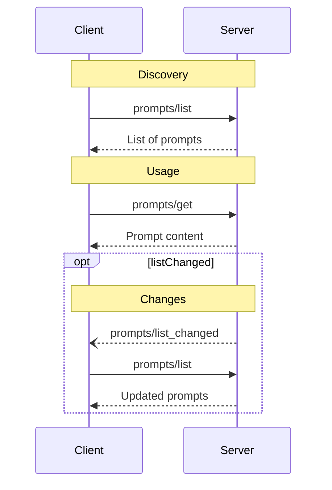
```mermaid
sequenceDiagram
    participant Client
    participant Server

    Note over Client,Server: Discovery
    Client->>Server: prompts/list
    Server-->>Client: List of prompts

    Note over Client,Server: Usage
    Client->>Server: prompts/get
    Server-->>Client: Prompt content

    opt listChanged
      Note over Client,Server: Changes
      Server--)Client: prompts/list_changed
      Client->>Server: prompts/list
      Server-->>Client: Updated prompts
    end
```

## Data Types

### Prompt

A prompt definition includes:

- `name`: Unique identifier for the prompt
- `description`: Optional human-readable description
- `arguments`: Optional list of arguments for customization

### PromptMessage

Messages in a prompt can contain:

- `role`: Either "user" or "assistant" to indicate the speaker
- `content`: One of the following content types:

#### Text Content
Text content represents plain text messages:
```json
{
  "type": "text",
  "text": "The text content of the message"
}
```
This is the most common content type used for natural language interactions.

#### Image Content
Image content allows including visual information in messages:
```json
{
  "type": "image",
  "data": "base64-encoded-image-data",
  "mimeType": "image/png"
}
```
The image data MUST be base64-encoded and include a valid MIME type. This enables multi-modal interactions where visual context is important.

#### Embedded Resources
Embedded resources allow referencing server-side resources directly in messages:
```json
{
  "type": "resource",
  "resource": {
    "uri": "resource://example",
    "mimeType": "text/plain",
    "text": "Resource content"
  }
}
```

Resources can contain either text or binary (blob) data and MUST include:
- A valid resource URI
- The appropriate MIME type
- Either text content or base64-encoded blob data

Embedded resources enable prompts to seamlessly incorporate server-managed content like documentation, code samples, or other reference materials directly into the conversation flow.

## Error Handling

Servers SHOULD return standard JSON-RPC errors for common failure cases:

- Invalid prompt name: `-32602` (Invalid params)
- Missing required arguments: `-32602` (Invalid params)
- Internal errors: `-32603` (Internal error)

## Implementation Considerations

1. Servers **SHOULD** validate prompt arguments before processing
2. Clients **SHOULD** handle pagination for large prompt lists
3. Both parties **SHOULD** respect capability negotiation

## Security

Implementations **MUST** carefully validate all prompt inputs and outputs to prevent injection attacks or unauthorized access to resources.

================
File: docs/mcp-specs/specification/server/resources.md
================
---
title: Resources
type: docs
weight: 20
---


**Protocol Revision**: 


The Model Context Protocol (MCP) provides a standardized way for servers to expose resources to clients. Resources allow servers to share data that provides context to language models, such as files, database schemas, or application-specific information. Each resource is uniquely identified by a [URI](https://datatracker.ietf.org/doc/html/rfc3986).

## User Interaction Model

Resources in MCP are designed to be **application-driven**, with host applications determining how to incorporate context based on their needs.

For example, applications could:
* Expose resources through UI elements for explicit selection, in a tree or list view
* Allow the user to search through and filter available resources
* Implement automatic context inclusion, based on heuristics or the AI model's selection


However, implementations are free to expose resources through any interface pattern that suits their needs&mdash;the protocol itself does not mandate any specific user interaction model.

## Capabilities

Servers that support resources **MUST** declare the `resources` capability:

```json
{
  "capabilities": {
    "resources": {
      "subscribe": true,
      "listChanged": true
    }
  }
}
```

The capability supports two optional features:
- `subscribe`: whether the client can subscribe to be notified of changes to individual resources.
- `listChanged`: whether the server will emit notifications when the list of available resources changes.

Both `subscribe` and `listChanged` are optional&mdash;servers can support neither, either, or both:

```json
{
  "capabilities": {
    "resources": {}  // Neither feature supported
  }
}
```

```json
{
  "capabilities": {
    "resources": {
      "subscribe": true  // Only subscriptions supported
    }
  }
}
```

```json
{
  "capabilities": {
    "resources": {
      "listChanged": true  // Only list change notifications supported
    }
  }
}
```

## Protocol Messages

### Listing Resources

To discover available resources, clients send a `resources/list` request. This operation supports [pagination]().

**Request:**
```json
{
  "jsonrpc": "2.0",
  "id": 1,
  "method": "resources/list",
  "params": {
    "cursor": "optional-cursor-value"
  }
}
```

**Response:**
```json
{
  "jsonrpc": "2.0",
  "id": 1,
  "result": {
    "resources": [
      {
        "uri": "file:///project/src/main.rs",
        "name": "main.rs",
        "description": "Primary application entry point",
        "mimeType": "text/x-rust"
      }
    ],
    "nextCursor": "next-page-cursor"
  }
}
```

### Reading Resources

To retrieve resource contents, clients send a `resources/read` request:

**Request:**
```json
{
  "jsonrpc": "2.0",
  "id": 2,
  "method": "resources/read",
  "params": {
    "uri": "file:///project/src/main.rs"
  }
}
```

**Response:**
```json
{
  "jsonrpc": "2.0",
  "id": 2,
  "result": {
    "contents": [
      {
        "uri": "file:///project/src/main.rs",
        "mimeType": "text/x-rust",
        "text": "fn main() {\n    println!(\"Hello world!\");\n}"
      }
    ]
  }
}
```

### Resource Templates

Resource templates allow servers to expose parameterized resources using [URI templates](https://datatracker.ietf.org/doc/html/rfc6570). Arguments may be auto-completed through [the completion API]().

**Request:**
```json
{
  "jsonrpc": "2.0",
  "id": 3,
  "method": "resources/templates/list"
}
```

**Response:**
```json
{
  "jsonrpc": "2.0",
  "id": 3,
  "result": {
    "resourceTemplates": [
      {
        "uriTemplate": "file:///{path}",
        "name": "Project Files",
        "description": "Access files in the project directory",
        "mimeType": "application/octet-stream"
      }
    ]
  }
}
```

### List Changed Notification

When the list of available resources changes, servers that declared the `listChanged` capability **SHOULD** send a notification:

```json
{
  "jsonrpc": "2.0",
  "method": "notifications/resources/list_changed"
}
```

### Subscriptions

The protocol supports optional subscriptions to resource changes. Clients can subscribe to specific resources and receive notifications when they change:

**Subscribe Request:**
```json
{
  "jsonrpc": "2.0",
  "id": 4,
  "method": "resources/subscribe",
  "params": {
    "uri": "file:///project/src/main.rs"
  }
}
```

**Update Notification:**
```json
{
  "jsonrpc": "2.0",
  "method": "notifications/resources/updated",
  "params": {
    "uri": "file:///project/src/main.rs"
  }
}
```

## Message Flow

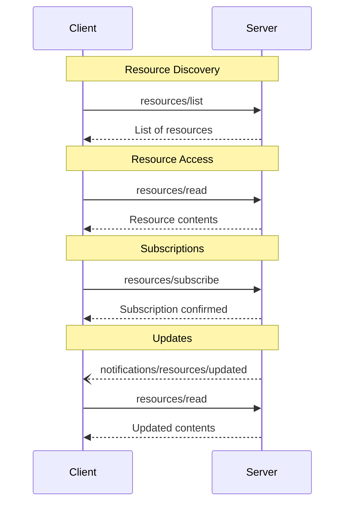
```mermaid
sequenceDiagram
    participant Client
    participant Server

    Note over Client,Server: Resource Discovery
    Client->>Server: resources/list
    Server-->>Client: List of resources

    Note over Client,Server: Resource Access
    Client->>Server: resources/read
    Server-->>Client: Resource contents

    Note over Client,Server: Subscriptions
    Client->>Server: resources/subscribe
    Server-->>Client: Subscription confirmed

    Note over Client,Server: Updates
    Server--)Client: notifications/resources/updated
    Client->>Server: resources/read
    Server-->>Client: Updated contents
```

## Data Types

### Resource

A resource definition includes:

- `uri`: Unique identifier for the resource
- `name`: Human-readable name
- `description`: Optional description
- `mimeType`: Optional MIME type

### Resource Contents

Resources can contain either text or binary data:

#### Text Content
```json
{
  "uri": "file:///example.txt",
  "mimeType": "text/plain",
  "text": "Resource content"
}
```

#### Binary Content
```json
{
  "uri": "file:///example.png",
  "mimeType": "image/png",
  "blob": "base64-encoded-data"
}
```

## Common URI Schemes

The protocol defines several standard URI schemes. This list not exhaustive&mdash;implementations are always free to use additional, custom URI schemes.

### https://

Used to represent a resource available on the web.

Servers **SHOULD** use this scheme only when the client is able to fetch and load the resource directly from the web on its own—that is, it doesn’t need to read the resource via the MCP server.

For other use cases, servers **SHOULD** prefer to use another URI scheme, or define a custom one, even if the server will itself be downloading resource contents over the internet.

### file://

Used to identify resources that behave like a filesystem. However, the resources do not need to map to an actual physical filesystem.

MCP servers **MAY** identify file:// resources with an [XDG MIME type](https://specifications.freedesktop.org/shared-mime-info-spec/0.14/ar01s02.html#id-1.3.14), like `inode/directory`, to represent non-regular files (such as directories) that don’t otherwise have a standard MIME type.

### git://

Git version control integration.

## Error Handling

Servers SHOULD return standard JSON-RPC errors for common failure cases:

- Resource not found: `-32002`
- Internal errors: `-32603`

Example error:
```json
{
  "jsonrpc": "2.0",
  "id": 5,
  "error": {
    "code": -32002,
    "message": "Resource not found",
    "data": {
      "uri": "file:///nonexistent.txt"
    }
  }
}
```

## Security Considerations

1. Servers **MUST** validate all resource URIs
2. Access controls **SHOULD** be implemented for sensitive resources
3. Binary data **MUST** be properly encoded
4. Resource permissions **SHOULD** be checked before operations

================
File: docs/mcp-specs/specification/server/tools.md
================
---
title: Tools
type: docs
weight: 40
---


**Protocol Revision**: 


The Model Context Protocol (MCP) allows servers to expose tools that can be invoked by language models. Tools enable models to interact with external systems, such as querying databases, calling APIs, or performing computations. Each tool is uniquely identified by a name and includes metadata describing its schema.

## User Interaction Model

Tools in MCP are designed to be **model-controlled**, meaning that the language model can discover and invoke tools automatically based on its contextual understanding and the user's prompts.

However, implementations are free to expose tools through any interface pattern that suits their needs&mdash;the protocol itself does not mandate any specific user interaction model.


  For trust & safety and security, there **SHOULD** always be a human in the loop with the ability to deny tool invocations.
  
  Applications **SHOULD**:
  * Provide UI that makes clear which tools are being exposed to the AI model
  * Insert clear visual indicators when tools are invoked
  * Present confirmation prompts to the user for operations, to ensure a human is in the loop


## Capabilities

Servers that support tools **MUST** declare the `tools` capability:

```json
{
  "capabilities": {
    "tools": {
      "listChanged": true
    }
  }
}
```

`listChanged` indicates whether the server will emit notifications when the list of available tools changes.

## Protocol Messages

### Listing Tools

To discover available tools, clients send a `tools/list` request. This operation supports [pagination]().

**Request:**
```json
{
  "jsonrpc": "2.0",
  "id": 1,
  "method": "tools/list",
  "params": {
    "cursor": "optional-cursor-value"
  }
}
```

**Response:**
```json
{
  "jsonrpc": "2.0",
  "id": 1,
  "result": {
    "tools": [
      {
        "name": "get_weather",
        "description": "Get current weather information for a location",
        "inputSchema": {
          "type": "object",
          "properties": {
            "location": {
              "type": "string",
              "description": "City name or zip code"
            }
          },
          "required": ["location"]
        }
      }
    ],
    "nextCursor": "next-page-cursor"
  }
}
```

### Calling Tools

To invoke a tool, clients send a `tools/call` request:

**Request:**
```json
{
  "jsonrpc": "2.0",
  "id": 2,
  "method": "tools/call",
  "params": {
    "name": "get_weather",
    "arguments": {
      "location": "New York"
    }
  }
}
```

**Response:**
```json
{
  "jsonrpc": "2.0",
  "id": 2,
  "result": {
    "content": [{
      "type": "text",
      "text": "Current weather in New York:\nTemperature: 72°F\nConditions: Partly cloudy"
    }],
    "isError": false
  }
}
```

### List Changed Notification

When the list of available tools changes, servers that declared the `listChanged` capability **SHOULD** send a notification:

```json
{
  "jsonrpc": "2.0",
  "method": "notifications/tools/list_changed"
}
```

## Message Flow

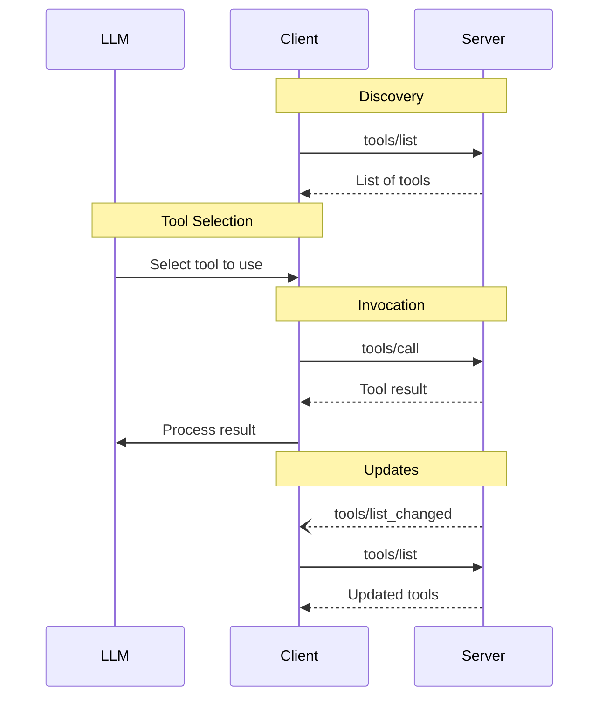
```mermaid
sequenceDiagram
    participant LLM
    participant Client
    participant Server

    Note over Client,Server: Discovery
    Client->>Server: tools/list
    Server-->>Client: List of tools

    Note over Client,LLM: Tool Selection
    LLM->>Client: Select tool to use

    Note over Client,Server: Invocation
    Client->>Server: tools/call
    Server-->>Client: Tool result
    Client->>LLM: Process result

    Note over Client,Server: Updates
    Server--)Client: tools/list_changed
    Client->>Server: tools/list
    Server-->>Client: Updated tools
```

## Data Types

### Tool

A tool definition includes:

- `name`: Unique identifier for the tool
- `description`: Human-readable description of functionality
- `inputSchema`: JSON Schema defining expected parameters

### Tool Result

Tool results can contain multiple content items of different types:

#### Text Content
```json
{
  "type": "text",
  "text": "Tool result text"
}
```

#### Image Content
```json
{
  "type": "image",
  "data": "base64-encoded-data",
  "mimeType": "image/png"
}
```

#### Embedded Resources

[Resources]() **MAY** be embedded, to provide additional context or data, behind a URI that can be subscribed to or fetched again by the client later:

```json
{
  "type": "resource",
  "resource": {
    "uri": "resource://example",
    "mimeType": "text/plain",
    "text": "Resource content"
  }
}
```

## Error Handling

Tools use two error reporting mechanisms:

1. **Protocol Errors**: Standard JSON-RPC errors for issues like:
   - Unknown tools
   - Invalid arguments
   - Server errors

2. **Tool Execution Errors**: Reported in tool results with `isError: true`:
   - API failures
   - Invalid input data
   - Business logic errors

Example protocol error:
```json
{
  "jsonrpc": "2.0",
  "id": 3,
  "error": {
    "code": -32602,
    "message": "Unknown tool: invalid_tool_name"
  }
}
```

Example tool execution error:
```json
{
  "jsonrpc": "2.0",
  "id": 4,
  "result": {
    "content": [{
      "type": "text",
      "text": "Failed to fetch weather data: API rate limit exceeded"
    }],
    "isError": true
  }
}
```

## Security Considerations

1. Servers **MUST**:
   - Validate all tool inputs
   - Implement proper access controls
   - Rate limit tool invocations
   - Sanitize tool outputs

2. Clients **SHOULD**:
   - Prompt for user confirmation on sensitive operations
   - Show tool inputs to the user before calling the server, to avoid malicious or accidental data exfiltration
   - Validate tool results before passing to LLM
   - Implement timeouts for tool calls
   - Log tool usage for audit purposes

================
File: docs/mcp-specs/specification/index.md
================
---
title: Specification
cascade:
  type: docs
breadcrumbs: false
weight: 10
---


**Protocol Revision**: 


[Model Context Protocol](https://modelcontextprotocol.io) (MCP) is an open protocol that enables seamless integration between LLM applications and external data sources and tools. Whether you're building an AI-powered IDE, enhancing a chat interface, or creating custom AI workflows, MCP provides a standardized way to connect LLMs with the context they need.

This specification defines the authoritative protocol requirements, based on the TypeScript schema in [schema.ts](https://github.com/modelcontextprotocol/specification/blob/main/schema/schema.ts).

For implementation guides and examples, visit [modelcontextprotocol.io](https://modelcontextprotocol.io).

## Overview

MCP provides a standardized way for applications to:

- Share contextual information with language models
- Expose tools and capabilities to AI systems
- Build composable integrations and workflows

The protocol uses [JSON-RPC](https://www.jsonrpc.org/) 2.0 messages to establish communication between:

- **Hosts**: LLM applications that initiate connections
- **Clients**: Connectors within the host application
- **Servers**: Services that provide context and capabilities

MCP takes some inspiration from the [Language Server Protocol](https://microsoft.github.io/language-server-protocol/), which standardizes how to add support for programming languages across a whole ecosystem of development tools. In a similar way, MCP standardizes how to integrate additional context and tools into the ecosystem of AI applications.

## Key Details

### Base Protocol
- [JSON-RPC](https://www.jsonrpc.org/) message format
- Stateful connections
- Server and client capability negotiation

### Features

Servers offer any of the following features to clients:

- **Resources**: Context and data, for the user or the AI model to use
- **Prompts**: Templated messages and workflows for users
- **Tools**: Functions for the AI model to execute

Clients may offer the following feature to servers:

- **Sampling**: Server-initiated agentic behaviors and recursive LLM interactions

### Additional Utilities

- Configuration
- Progress tracking
- Cancellation
- Error reporting
- Logging

## Security and Trust & Safety

The Model Context Protocol enables powerful capabilities through arbitrary data access and code execution paths. With this power comes important security and trust considerations that all implementors must carefully address.

### Key Principles

1. **User Consent and Control**
   - Users must explicitly consent to and understand all data access and operations
   - Users must retain control over what data is shared and what actions are taken
   - Implementors should provide clear UIs for reviewing and authorizing activities

2. **Data Privacy**
   - Hosts must obtain explicit user consent before exposing user data to servers
   - Hosts must not transmit resource data elsewhere without user consent
   - User data should be protected with appropriate access controls

3. **Tool Safety**
   - Tools represent arbitrary code execution and must be treated with appropriate caution
   - Hosts must obtain explicit user consent before invoking any tool
   - Users should understand what each tool does before authorizing its use

4. **LLM Sampling Controls**
   - Users must explicitly approve any LLM sampling requests
   - Users should control:
     - Whether sampling occurs at all
     - The actual prompt that will be sent
     - What results the server can see
   - The protocol intentionally limits server visibility into prompts

### Implementation Guidelines

While MCP itself cannot enforce these security principles at the protocol level, implementors **SHOULD**:

1. Build robust consent and authorization flows into their applications
2. Provide clear documentation of security implications
3. Implement appropriate access controls and data protections
4. Follow security best practices in their integrations
5. Consider privacy implications in their feature designs

## Learn More

Explore the detailed specification for each protocol component:


  
  
  
  
  


================
File: docs/mcp-specs/about.md
================
# Model Context Protocol Specs

2024-11-28

from https://github.com/modelcontextprotocol/specification

================
File: docs/mcp-specs/links.md
================
---
title: "Additional Resources"
weight: 20
breadcrumbs: false
sidebar:
  exclude: true
---

The Model Context Protocol (MCP) provides multiple resources for documentation and implementation:

- **User Documentation**: Visit [modelcontextprotocol.io](https://modelcontextprotocol.io) for comprehensive user-facing documentation
- **Python SDK**: The Python implementation is available at [github.com/modelcontextprotocol/python-sdk](https://github.com/modelcontextprotocol/python-sdk) - [Discussions](https://github.com/modelcontextprotocol/python-sdk/discussions)
- **Specification**: The core specification is available at [github.com/modelcontextprotocol/specification](https://github.com/modelcontextprotocol/specification) - [Discussions](https://github.com/modelcontextprotocol/specification/discussions)
- **TypeScript SDK**: The TypeScript implementation can be found at [github.com/modelcontextprotocol/typescript-sdk](https://github.com/modelcontextprotocol/typescript-sdk) - [Discussions](https://github.com/modelcontextprotocol/typescript-sdk/discussions)

For questions or discussions, please open a discussion in the appropriate GitHub repository based on your implementation or use case. You can also visit the [Model Context Protocol organization on GitHub](https://github.com/modelcontextprotocol) to see all repositories and ongoing development.

================
File: src/index.ts
================
#!/usr/bin/env node

/**
 * This is a template MCP server that implements a simple notes system.
 * It demonstrates core MCP concepts like resources and tools by allowing:
 * - Listing notes as resources
 * - Reading individual notes
 * - Creating new notes via a tool
 * - Summarizing all notes via a prompt
 */

import { Server } from "@modelcontextprotocol/sdk/server/index.js";
import { StdioServerTransport } from "@modelcontextprotocol/sdk/server/stdio.js";
import {
  CallToolRequestSchema,
  ListResourcesRequestSchema,
  ListToolsRequestSchema,
  ReadResourceRequestSchema,
  ListPromptsRequestSchema,
  GetPromptRequestSchema,
} from "@modelcontextprotocol/sdk/types.js";

/**
 * Type alias for a note object.
 */
type Note = { title: string, content: string };

/**
 * Simple in-memory storage for notes.
 * In a real implementation, this would likely be backed by a database.
 */
const notes: { [id: string]: Note } = {
  "1": { title: "First Note", content: "This is note 1" },
  "2": { title: "Second Note", content: "This is note 2" }
};

/**
 * Create an MCP server with capabilities for resources (to list/read notes),
 * tools (to create new notes), and prompts (to summarize notes).
 */
const server = new Server(
  {
    name: "My MCP Server",
    version: "0.1.0",
  },
  {
    capabilities: {
      resources: {},
      tools: {},
      prompts: {},
    },
  }
);

/**
 * Handler for listing available notes as resources.
 * Each note is exposed as a resource with:
 * - A note:// URI scheme
 * - Plain text MIME type
 * - Human readable name and description (now including the note title)
 */
server.setRequestHandler(ListResourcesRequestSchema, async () => {
  return {
    resources: Object.entries(notes).map(([id, note]) => ({
      uri: `note:///${id}`,
      mimeType: "text/plain",
      name: note.title,
      description: `A text note: ${note.title}`
    }))
  };
});

/**
 * Handler for reading the contents of a specific note.
 * Takes a note:// URI and returns the note content as plain text.
 */
server.setRequestHandler(ReadResourceRequestSchema, async (request) => {
  const url = new URL(request.params.uri);
  const id = url.pathname.replace(/^\//, '');
  const note = notes[id];

  if (!note) {
    throw new Error(`Note ${id} not found`);
  }

  return {
    contents: [{
      uri: request.params.uri,
      mimeType: "text/plain",
      text: note.content
    }]
  };
});

/**
 * Handler that lists available tools.
 * Exposes a single "create_note" tool that lets clients create new notes.
 */
server.setRequestHandler(ListToolsRequestSchema, async () => {
  return {
    tools: [
      {
        name: "create_note",
        description: "Create a new note",
        inputSchema: {
          type: "object",
          properties: {
            title: {
              type: "string",
              description: "Title of the note"
            },
            content: {
              type: "string",
              description: "Text content of the note"
            }
          },
          required: ["title", "content"]
        }
      }
    ]
  };
});

/**
 * Handler for the create_note tool.
 * Creates a new note with the provided title and content, and returns success message.
 */
server.setRequestHandler(CallToolRequestSchema, async (request) => {
  switch (request.params.name) {
    case "create_note": {
      const title = String(request.params.arguments?.title);
      const content = String(request.params.arguments?.content);
      if (!title || !content) {
        throw new Error("Title and content are required");
      }

      const id = String(Object.keys(notes).length + 1);
      notes[id] = { title, content };

      return {
        content: [{
          type: "text",
          text: `Created note ${id}: ${title}`
        }]
      };
    }

    default:
      throw new Error("Unknown tool");
  }
});

/**
 * Handler that lists available prompts.
 * Exposes a single "summarize_notes" prompt that summarizes all notes.
 */
server.setRequestHandler(ListPromptsRequestSchema, async () => {
  return {
    prompts: [
      {
        name: "summarize_notes",
        description: "Summarize all notes",
      }
    ]
  };
});

/**
 * Handler for the summarize_notes prompt.
 * Returns a prompt that requests summarization of all notes, with the notes' contents embedded as resources.
 */
server.setRequestHandler(GetPromptRequestSchema, async (request) => {
  if (request.params.name !== "summarize_notes") {
    throw new Error("Unknown prompt");
  }

  const embeddedNotes = Object.entries(notes).map(([id, note]) => ({
    type: "resource" as const,
    resource: {
      uri: `note:///${id}`,
      mimeType: "text/plain",
      text: note.content
    }
  }));

  return {
    messages: [
      {
        role: "user",
        content: {
          type: "text",
          text: "Please summarize the following notes:"
        }
      },
      ...embeddedNotes.map(note => ({
        role: "user" as const,
        content: note
      })),
      {
        role: "user",
        content: {
          type: "text",
          text: "Provide a concise summary of all the notes above."
        }
      }
    ]
  };
});

/**
 * Start the server using stdio transport.
 * This allows the server to communicate via standard input/output streams.
 */
async function main() {
  const transport = new StdioServerTransport();
  await server.connect(transport);
}

main().catch((error) => {
  console.error("Server error:", error);
  process.exit(1);
});

================
File: _README.md
================
# My MCP Server MCP Server

A custom MCP server

This is a TypeScript-based MCP server that implements a simple notes system. It demonstrates core MCP concepts by providing:

- Resources representing text notes with URIs and metadata
- Tools for creating new notes
- Prompts for generating summaries of notes

## Features

### Resources
- List and access notes via `note://` URIs
- Each note has a title, content and metadata
- Plain text mime type for simple content access

### Tools
- `create_note` - Create new text notes
  - Takes title and content as required parameters
  - Stores note in server state

### Prompts
- `summarize_notes` - Generate a summary of all stored notes
  - Includes all note contents as embedded resources
  - Returns structured prompt for LLM summarization

## Development

Install dependencies:
```bash
npm install
```

Build the server:
```bash
npm run build
```

For development with auto-rebuild:
```bash
npm run watch
```

## Installation

To use with Claude Desktop, add the server config:

On MacOS: `~/Library/Application Support/Claude/claude_desktop_config.json`
On Windows: `%APPDATA%/Claude/claude_desktop_config.json`

```json
{
  "mcpServers": {
    "My MCP Server": {
      "command": "/path/to/My MCP Server/build/index.js"
    }
  }
}
```

### Debugging

Since MCP servers communicate over stdio, debugging can be challenging. We recommend using the [MCP Inspector](https://github.com/modelcontextprotocol/inspector), which is available as a package script:

```bash
npm run inspector
```

The Inspector will provide a URL to access debugging tools in your browser.

================
File: package.json
================
{
  "name": "chauvin",
  "version": "0.1.0",
  "description": "A custom MCP server",
  "private": true,
  "type": "module",
  "bin": {
    "My MCP Server": "./build/index.js"
  },
  "files": [
    "build"
  ],
  "scripts": {
    "build": "tsc && node -e \"require('fs').chmodSync('build/index.js', '755')\"",
    "prepare": "npm run build",
    "watch": "tsc --watch",
    "inspector": "npx @modelcontextprotocol/inspector build/index.js",
    "rp": "repopack -c repomix.config.json ."
  },
  "dependencies": {
    "@modelcontextprotocol/sdk": "0.6.0"
  },
  "devDependencies": {
    "@types/node": "^20.11.24",
    "typescript": "^5.3.3"
  }
}

================
File: README.md
================
# chauvin
Model Context Protocol server

================
File: repomix.config.json
================
{
  "output": {
    "filePath": "chauvin-repomix.md",
    "style": "plain",
    "removeComments": false,
    "removeEmptyLines": false,
    "topFilesLength": 5,
    "showLineNumbers": false,
    "copyToClipboard": false
  },
  "include": [
    "**/*.md",
    "**/*.mdx",
    "**/*.ttl",
    "**/*.json",
    "**/*.ts"
  ],
  "ignore": {
    "useGitignore": true,
    "useDefaultPatterns": true,
    "customPatterns": [
      ".git",
      "docs/mcp-specs/docs"
    ]
  },
  "security": {
    "enableSecurityCheck": true
  }
}

================
File: tsconfig.json
================
{
  "compilerOptions": {
    "target": "ES2022",
    "module": "Node16",
    "moduleResolution": "Node16",
    "outDir": "./build",
    "rootDir": "./src",
    "strict": true,
    "esModuleInterop": true,
    "skipLibCheck": true,
    "forceConsistentCasingInFileNames": true
  },
  "include": ["src/**/*"],
  "exclude": ["node_modules"]
}
